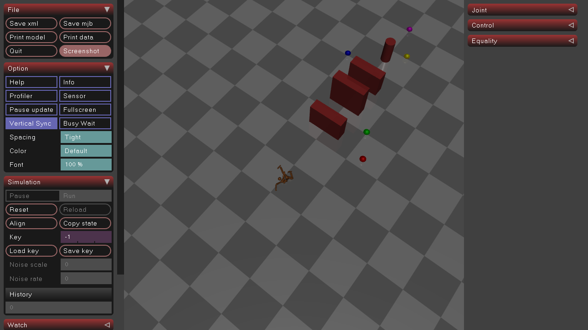
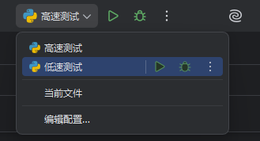
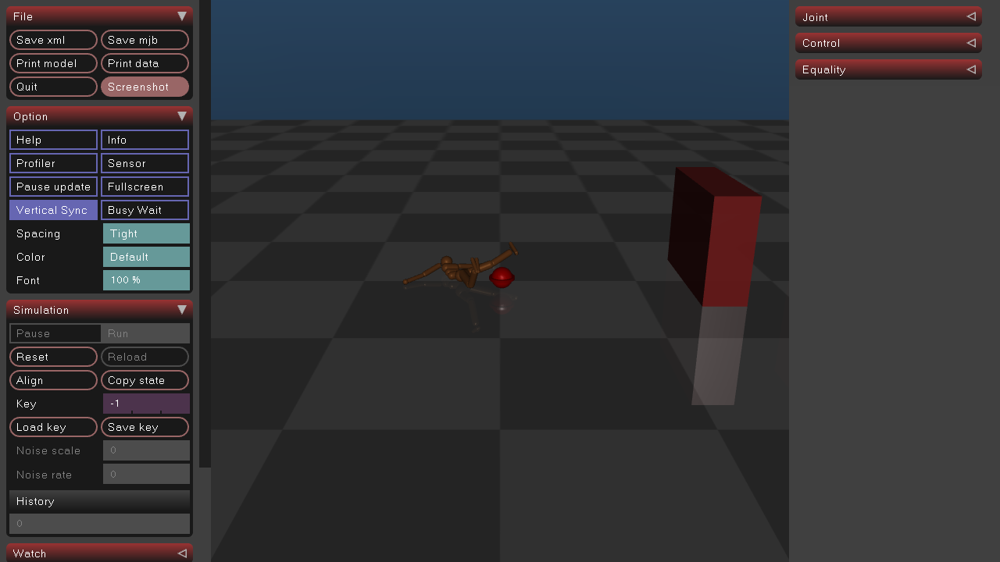
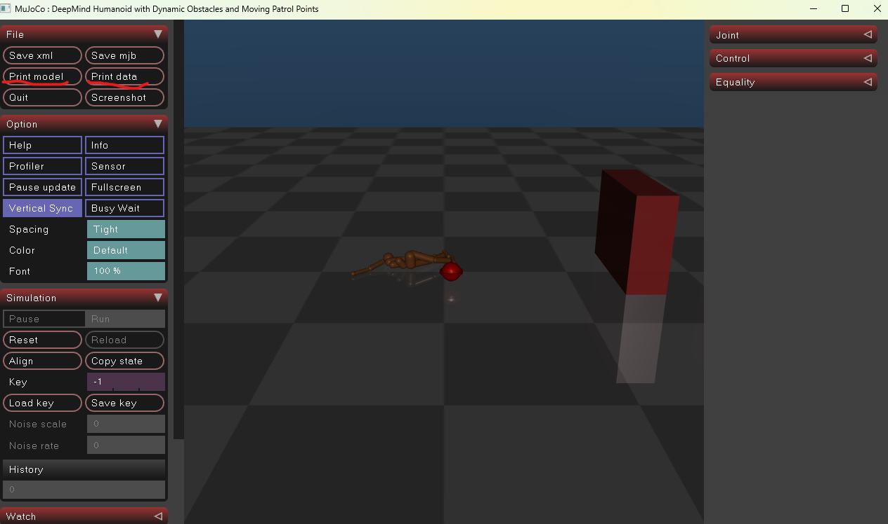
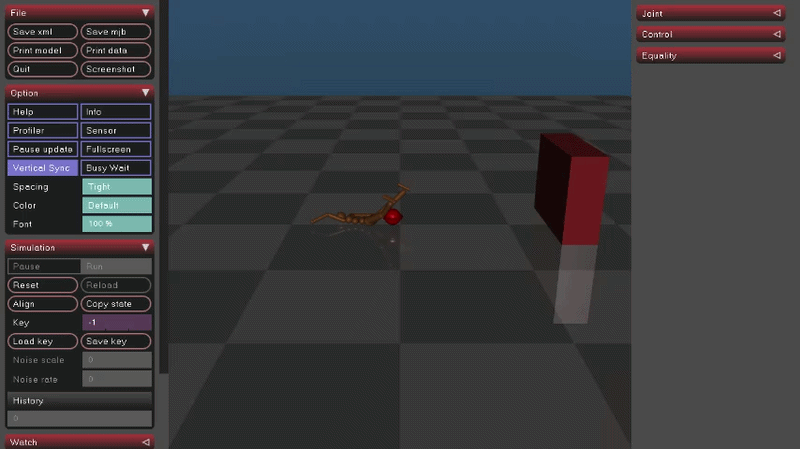
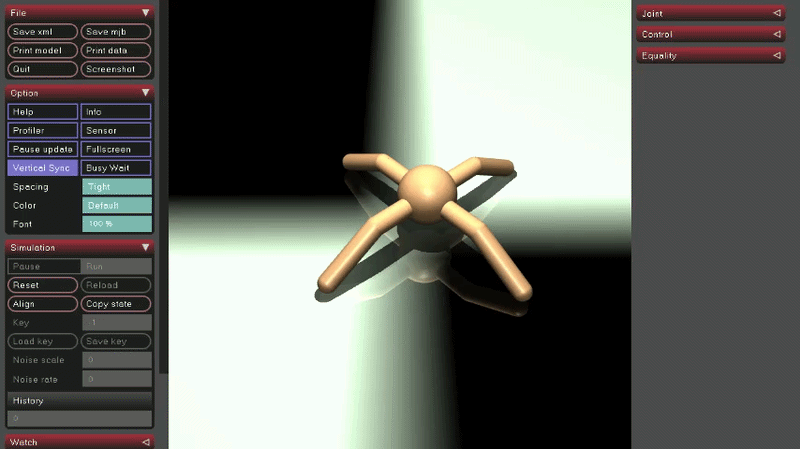
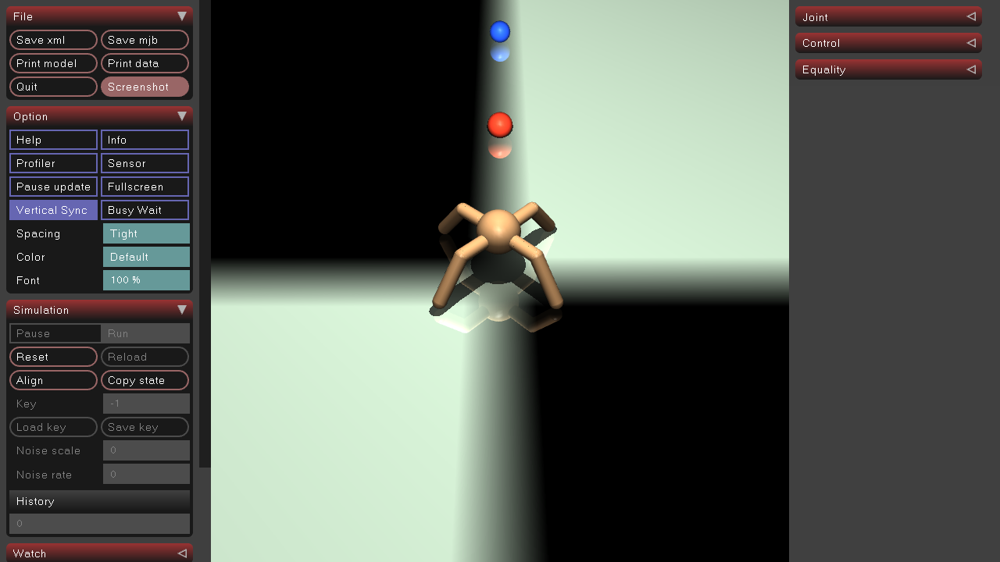
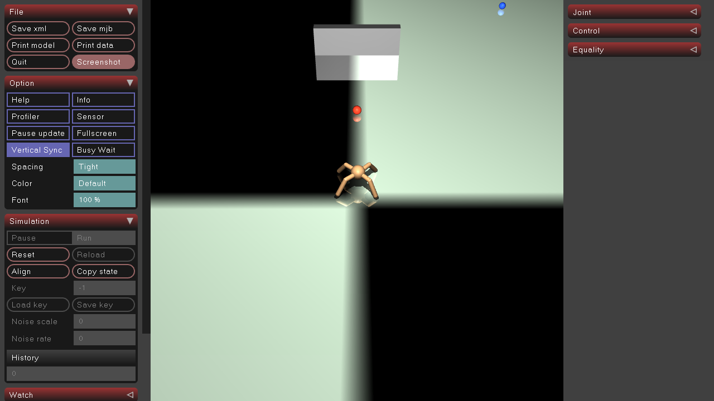
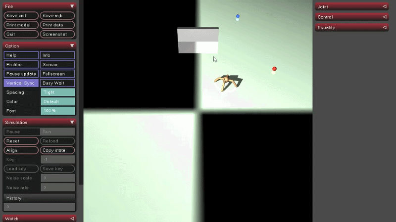

# 机器人仿真系统 (Humanoid Robot Simulation)

# 背景介绍

这是一个基于 Python 和 MuJoCo 物理引擎的机器人仿真项目。目的是实现机器人行走和巡逻功能。

本项目旨在实现：

## 距离优先的多目标巡逻与智能避障

场地上存在多个运动的小球，机器人会时刻计算自己离每个小球有多远，谁离得近就追谁，追到了之后就自动换下一个目标，在追到所有小球之后就停止。场景里会有多堵墙壁，机器人一旦碰到某堵墙，就会自动转向，绕开墙后继续追逐目标。



## 仿人步态与稳定平衡控制

机器人会像人一样交替迈腿、摆臂，同时通过腰部的扭动和质心调整让自己不会摔倒。所有关节的力量都限制在安全范围内，避免机器人突然飞出去或原地抽搐

## 仿真运行与可视化跟踪

启动 MuJoCo 的 3D 窗口，相机自动跟随机器人，保证它始终在屏幕中央。同时每 2 秒在控制台打印一次当前状态（位置、目标距离、最近障碍物等），按 Ctrl+C 可以随时结束并看总结报告。

# 新增功能

## 参数透传功能

```python
self.target_move_speed = 0.2  # Slow target movement for stability
self.forward_speed = 0.05  # Reduced speed to prevent flying (fix disappearing issue)
```

```python
self.target_move_speed = args.target_move_speed if args else 0.2  # 动态目标移动速度
self.forward_speed = args.forward_speed if args else 0.05  # 机器人前进速度
```

之前的代码把参数写死在代码里，想要修改参数就必须回到脚本中修改代码，很麻烦而且容易出错。现在引入了`argparse` 库来规范地接收参数，可以在 PyCharm 的 **Parameters** 配置框中（或者直接在终端里）输入参数，无需修改代码。




## 移除阻塞式的 `input()` (适配自动化部署)

```python
     # Ask for auto-install
    if input("\n📥 Auto-install missing packages? (y/n): ").lower() == 'y':
        try:
            subprocess.run(
                [sys.executable, "-m", "pip", "install"] + missing_packages,
                check=True
            )
            print("✅ Packages installed successfully")
        except subprocess.CalledProcessError as e:
            print(f"❌ Package installation failed: {e}")
            sys.exit(1)
```

```python
def get_user_input_with_timeout(timeout=5):
    print(f"\n📥 Auto-install missing packages? (y/n) [将在 {timeout} 秒后默认选择 'y']: ", end='', flush=True)
    user_response = [None]

    def wait_for_input():
        try:
            user_response[0] = input()
        except EOFError:
            pass
```

原代码当检测到用户没有安装标准库时，会自动弹出选项让用户判断是否安装库，但问题在于，如果用户不输入选项，进程就会永久停留在这一步。

修改后，当进程在此停留timeout的时间后，如果用户依然没有输入，程序就会自动选择y并开始安装标准库。

## 依赖项配置外置

```python
def check_dependencies():
    """
    Check required packages installation
    """
    required_packages = [
        "mujoco",
        "numpy"
    ]
```

```python
def check_dependencies():
    """
    Check required packages installation by reading requirements.txt
    """
    project_root = Path(__file__).resolve().parent
    req_file = project_root / "requirements.txt"
```

原代码写死了项目要安装的库，如果以后需要安装其它库的时候就需要修改代码，非常麻烦。

修改后，新增了requirements.txt文件，将依赖项全放置在其中，方便用户查看项目需要哪些依赖，也方便后面的增删。


以上内容均在原项目上修改，目的是方便项目的安装和调试，之后开始进行机器人步态调试。

# 机器人步态调试

原项目没有实现机器人站立和行走的功能，在原项目的基础上，我进行了多种尝试。



## 出生点穿模/电机力量过小

**出生点穿模爆炸：** 设置的初始高度（`z=0.8`）可能太低了。如果机器人的脚在第 0 帧时嵌在了地板内部，MuJoCo 的物理引擎为了解决“物体穿透”，会瞬间施加一个成千上万牛顿的排斥力，直接把它弹飞、抽搐。

**电机力量过小：** 代码里有一句 `self.max_ctrl_amplitude = 0.8`。这意味着无论机器人怎么拼命想站稳，发出的电机指令都被死死限制在了 0.8。这点力气根本不足以对抗重力支撑起它自己的体重。

应对这两个问题，我做了如下调节：

```python
self.balance_kp = 120.0        # 增强平衡控制器的刚度，让腰板挺直

self.max_joint_velocity = 2.0  # 放宽关节限速

self.max_ctrl_amplitude = 5.0  # ✨ 核心修复：把电机最大输出拉高，给它支撑体重的力气！

self.data.qpos[2] = 0.95 # ✨ 核心修复：把出生点太高一点，让它处于悬空状态，避免脚插进地板里
```

```python
if elapsed_time < self.stabilization_phase:
            # ✨ 加入“上帝之手”：给躯干施加向上的外力，像提着衣领一样让它慢慢站稳落地
            if self.torso_id != -1:
                # 提拉力随着时间从 200N 线性递减到 0N
                lift_force = 200.0 * (1.0 - (elapsed_time / self.stabilization_phase))
                self.data.xfrc_applied[self.torso_id][2] = lift_force

            self._maintain_balance(elapsed_time)
            # Clip all control commands during stabilization
            for i in range(self.model.nu):
                self.data.ctrl[i] = self._clip_control_command(self.data.ctrl[i])
            return
        else:
            # ✨ 稳定期结束后，撤销上帝之手，让机器人完全靠自己的双腿站立
            if self.torso_id != -1:
                self.data.xfrc_applied[self.torso_id][2] = 0.0
```

但是修改代码后小人依然是立刻直接落地，没有悬停，也没有站立起来。怀疑是施加的拉力太小，在调控拉力之后仍然没有变化，于是寻找其它原因。

## 碰撞穿模惩罚机制

在 MuJoCo 中，只要机器人的脚底板和地面发生了哪怕 $0.1$ 毫米的“穿透（Penetration）”，物理引擎为了把它们分开，会瞬间产生高达**数万牛顿**的排斥力。这个力比刚才算的几百牛顿的“体重提拉力”大了几十倍，所以机器人的力学状态瞬间就爆炸了，直接被拍在地上抽搐。

**直接在每一帧强行改写它躯干的空间坐标**。就像把它用钉子钉在半空中一样，无视重力，无视碰撞，强行让它在空中把腿伸直，然后再“拔掉钉子”让它落地。

```python
# Step 5: Initial stabilization phase (no movement, only balance)
        if elapsed_time < self.stabilization_phase:
            # ✨ 核弹级修复：时空绝对锁死！
            # 直接在内存底层把机器人“钉”在空中，无视任何物理法则
            
            # 1. 强行锁定根节点空间坐标 (悬空在 0.95m 处)
            self.data.qpos[0] = 0.0
            self.data.qpos[1] = 0.0
            self.data.qpos[2] = 0.95
            
            # 2. 强行锁定绝对垂直姿态 (四元数 [w, x, y, z])
            self.data.qpos[3:7] = [1.0, 0.0, 0.0, 0.0]
            
            # 3. 强行清零六轴速度 (禁止任何移动和旋转)
            self.data.qvel[0:6] = 0.0
            
            # 清除之前没用的外力
            if self.torso_id != -1:
                self.data.xfrc_applied[self.torso_id][2] = 0.0

            # 在被死死钉在空中的这两秒内，让四肢活动，摆出站立准备姿势
            self._maintain_balance(elapsed_time)
            
            for i in range(self.model.nu):
                self.data.ctrl[i] = self._clip_control_command(self.data.ctrl[i])
            return
```

可是依然没有变化。

## 寻址出错。

提取了model文件和data文件，进一步分析，发现发现Joint ID（关节ID） ≠ DOF ID（速度地址），也就是说对于脚部关节的速度设置可能移动到了腰部，所以小人在以脚步关节的速度翻转。

可能是项目原作者只考虑的机器人模型，没有考虑场景里加入了红色的巡逻点（patrol_slide）、加入了会动的墙壁（wall_slide）。在 MuJoCo 读取 XML 时，数据的地址错位，导致机器人在原地抽搐。



于是尝试寻找真正的内存地址：

```python
def _get_joint_vel_id(self, joint_name):
        """Get joint velocity ID for a given joint name"""
        mapped_name = self.joint_name_mapping.get(joint_name, joint_name)
        joint_id = mujoco.mj_name2id(self.model, mujoco.mjtObj.mjOBJ_JOINT, mapped_name)
        if joint_id != -1:
            # ✨ 史诗级底层修复：绝对不能直接返回 joint_id！
            # 必须通过 jnt_dofadr 查询该关节在 qvel 数组中真正的内存地址！
            return self.model.jnt_dofadr[joint_id]
        return -1
```

但是，还是没有变化，目前仍然没有找到问题所在。

当前，人形机器人仍然保持原地抽搐状态。



# ant动态巡逻避障

在调试机器人步态无果后，暂时放弃，转向动态巡逻于避障的研究

这次，选取了结构简单的ant模型，重点关注如何实现追踪小球和智能避障。

## 重构代码

首先，重构了原项目的机器人行动代码move_straight.py，在其基础上构建了对应ant模型的新模块。

### 感知模块：`perception.py`

**功能**：负责“看”。它不决定怎么走，只负责告诉大脑周围有什么。

- **雷达/射线探测**：封装 MuJoCo 的 `data.contact` 或通过计算 `geom` 距离，判断前方是否有障碍物。
- **距离计算**：提供一个简单的函数，返回距离最近障碍物的距离和角度。
- **目标向量**：计算当前位置到下一个巡逻点的欧几里得距离和相对方位角。

###  决策模块：`planner.py`

**功能**：负责“想”。它是机器人的“大脑”。

- **巡逻逻辑**：管理巡逻点队列（Target Queue），判断是否到达当前点并切换下一个。
- **避障算法**：根据 `perception.py` 传来的数据，计算一个“期望速度”和“期望朝向”。
  - *逻辑示例*：如果前方 1.2m 有障碍物，将期望朝向向右偏移 30 度。
- **状态机**：管理机器人的状态（巡逻中、避障中、停滞待机）。

### 运动控制模块：`locomotion.py`

**功能**：负责“走”。它只管把“大脑”的要求变成关节力矩。

- **基础步态发生器**：为 Ant 的 8 个关节生成周期性的正弦波（爬行波形）。
- **转向执行**：接收大脑的“转向”指令，通过改变左右两侧腿的频率或幅度实现转向。
- **PD 控制器**：通用的关节力矩计算公式（$Torque = Kp \cdot error - Kd \cdot velocity$）。

### 仿真引擎模块：`env_manager.py` 

**功能**：负责“活”。它是物理世界的宿主。

- **模型加载**：读取 `ant_config.py` 加载 XML。
- **软启动管理**：执行我们之前讨论的“开局锁定”逻辑，防止抽搐。
- **主循环**：调用上述三个模块，完成 `mj_step`。

## 直线行走

在重构代码后，发现ant机器人在原地扭动，不行走，检查发现是关节正负方向错误导致原地扭动



修改后能够直线行走

## 追踪小球

在小球前进方向上设置两个小球，当机器人碰到较近的小球后，再追踪较远的小球，碰到所有小球后停止



## 智能避障

在两个小球之间加上一堵墙，当机器人碰到墙后转向，绕过墙后继续追踪小球



## 动态小球追踪

让两个小球以一定速率运动，机器人动态追踪小球。



# 后期计划

项目后期有两个方向：

1.步态调整

重新转回人形机器人模型，尝试调整其步态，让其做到站立并行走

2.复杂场景

尝试构建更为复杂的场景，研究机器人在复杂环境中的巡逻避障能力