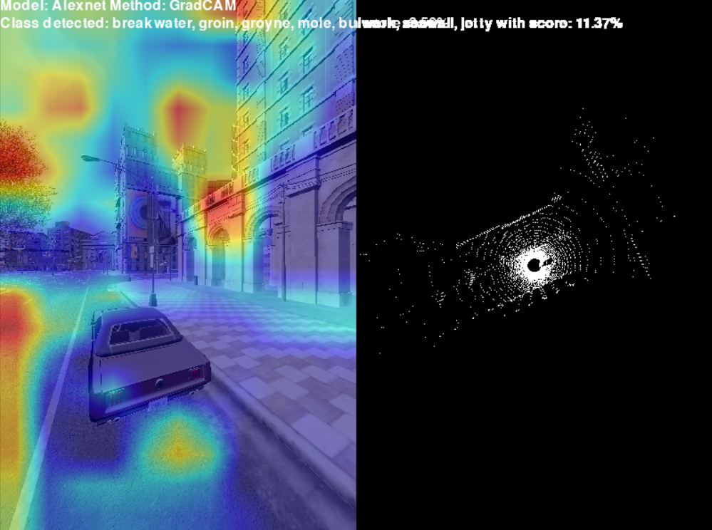
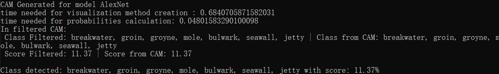
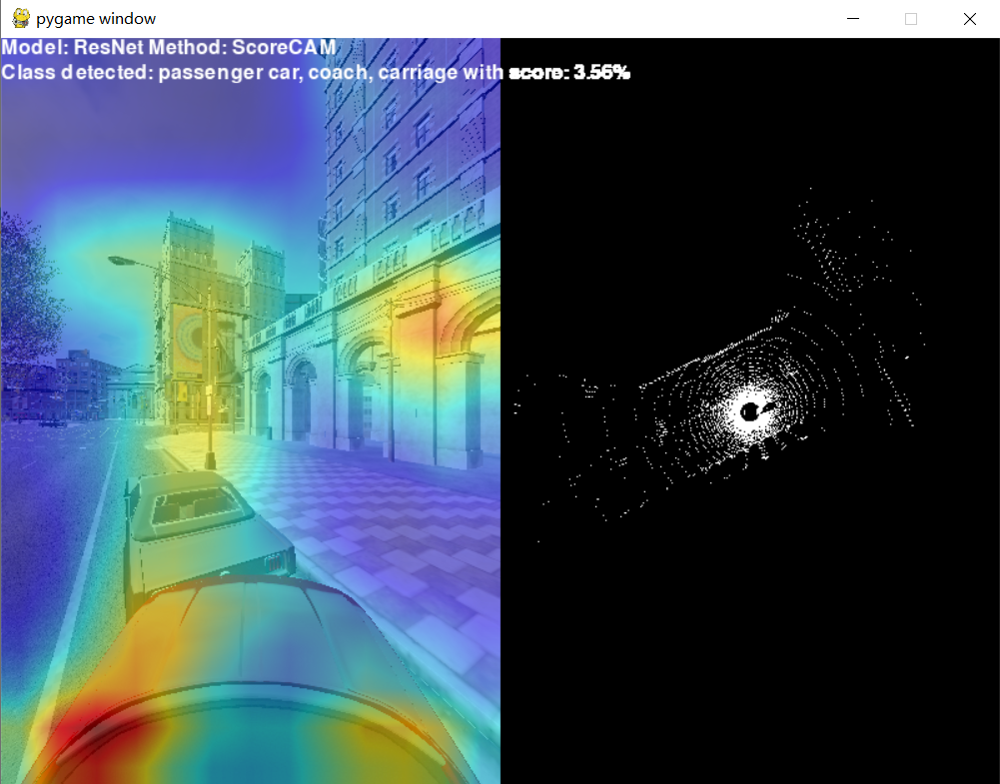
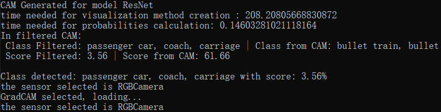

# carla_CAM

用于在 Carla 模拟器中使用类激活映射（Class Activation Mapping, CAM）技术测试卷积神经网络（CNN）的应用。
该项目旨在提高自动驾驶背景下深度学习模型的透明度。

## 1. CAM可视化核心原理与数学表达
在我们的项目中可以选择多种CAM算法，比如Grad CAM、Score CAM、Ablation CAM等。为了理解模型是如何产生热力图的，我们以最经典的Grad-CAM为例做解释：  
### 1.1 核心数学公式
Grad-CAM 的目的是计算出图像中哪些区域对网络预测某个特定类别 $c$（例如“汽车”或“高铁”）的贡献最大。  

**步骤1：计算特征图权重**  
假设网络最后一个卷积层输出的特征图为 $A$，其中第 $k$ 个通道的特征图记为 $A^k$。我们首先求目标类别分数 $y^c$（Softmax 激活前的值）对特征图 $A^k$ 中每个像素点 $(i, j)$ 的梯度，并进行全局平均池化（Global Average Pooling），得到神经元权重 $\alpha_k^c$：  
$$\alpha_k^c = \frac{1}{Z} \sum_i \sum_j \frac{\partial y^c}{\partial A_{i,j}^k}$$

 ---  

**步骤2：生成类激活热力图**  
将求得的权重 $\alpha_k^c$ 与对应的特征图 $A^k$ 进行线性加权求和，并通过 ReLU 激活函数过滤掉负向影响（我们只关心哪些特征正向促进了该类别的识别）：
$$L_{Grad-CAM}^c = ReLU \left( \sum_k \alpha_k^c A^k \right)$$

这一步你就可以看到生成的冷暖色调热力图。  

---

## 2. CAM 可视化方法对比  
这里我们用两个**截然不同**的流派来做对比：**Grad-CAM vs. Score-CAM**  
这两种方法代表了 CAM 技术演进中的两个截然不同的流派：**基于梯度（Gradient-based）**与**无梯度（Gradient-free/Perturbation-based）**。

| 对比维度 | Grad-CAM (基于梯度) | Score-CAM (无梯度) |
| :--- | :--- | :--- |
| **核心机制** | 计算目标类别得分对特征图像素的**偏导数**，进行全局平均池化（GAP）作为通道权重。 | 将特征图通道作为掩码（Mask）叠加到原图上，进行**多次前向传播**，以目标类别的置信度增量作为通道权重。 |
| **对梯度的依赖** | **完全依赖。** 需要反向传播计算梯度。 | **零依赖。** 仅通过前向推理评估特征的重要性。 |
| **计算开销** | **极小。** 仅需一次前向传播和一次反向传播，速度极快（毫秒级）。 | **极大。** 每个特征通道都需要进行一次独立的前向传播计算（在深层网络中可能耗时数秒至数分钟）。 |
| **特征映射质量** | 容易受到“梯度饱和（Gradient Saturation）”和深层网络“梯度破碎（Shattered Gradients）”噪声的影响，热力图可能呈现碎片化。 | 彻底规避了梯度噪声，生成的激活图通常更加**平滑、聚焦且具有更好的视觉连贯性**。 |
| **模型兼容性** | 要求模型及其目标层必须是**可微的**（Differentiable），对某些特殊架构（如缺乏梯度的自定义算子）不兼容。 | **模型不可知（Model Agnostic）。** 只要模型能输出分类分数即可，兼容性极高。 |
| **适用场景偏好** | 实时分析、大规模数据集的快速批量验证。 | 追求极高解释精度的单一样本深度分析，或用于存在不可微操作的复杂网络。 |  

---

## 3. 神经网络架构对比  

从特征提取的几何约束和拓扑偏置来看，这两种网络代表了深度学习早期“粗放式空间缩减”与现代“深度迭代细化”的根本差异。

| 对比维度 | AlexNet  | ResNet  |
| :--- | :--- | :--- |
| **网络深度** | **浅层 (Shallow)：** 典型的 8 层结构（5个卷积层 + 3个全连接层）。 | **超深层 (Deep)：** 18 到 152 层甚至更深。 |
| **核心拓扑基元** | **线性堆叠 (Linear Stacking)：** 标准的前馈逐层传递，无跨层信息交互。 | **残差连接 (Skip Connections / Shortcut)：** 引入跨层恒等映射，解决深度剧增带来的梯度消失问题。 |
| **初始感受野设计** | **极端的空间缩减：** 首层采用巨大的 $11 \times 11$ 卷积核和步长 4，导致极其强烈的局部几何结构提取偏置（对宏观边缘、纹理极敏感）。 | **温和的特征抽象：** 首层通常采用 $7 \times 7$ 卷积，随后大量依赖 $3 \times 3$ 微小卷积核的堆叠来逐步扩大感受野。 |
| **特征表征特征** | **低级视觉强绑定：** 由于层数少且缺乏跨层融合，其高层神经元仍保留大量对特定物理形状（如直线、简单几何体）的直接响应。 | **高度语义化/各向异性：** 通过深层残差聚合，浅层的几何基元被高度解构，网络更倾向于表征抽象的拓扑组合和复杂语义。 |
| **分类器的结构** | 尾部使用极其臃肿的（多达 4096 维）的多个全连接层（FC），占据了网络绝大部分参数。 | 摒弃了大型全连接层，采用全局平均池化（GAP）直接映射到类别输出，参数分布更侧重于卷积层本身。 |
| **结构性偏置的影响** | 在未经训练（Untrained）或面对领域外（OOD）数据时，极易被画面中强烈的宏观线条或边缘“锚定”而产生误判。 | 具有更强的平移不变性和复杂特征容错率，但也更容易发生过度依赖背景纹理而非目标主体形状的偏置（Texture Bias）。 |

 ---  

 ## 4. 不同解释性方法以及网络结构在场景中的对比  
 这里我们使用*方案一*：**AlexNet** + **Grad-CAM** 以及 *方案二*：**ResNet** + **Score-CAM** 来进行对比  

#### 1. 计算性能与显存开销 (Computational Overhead)

| 模型架构 | CAM 生成耗时 | 概率计算耗时 | 性能诊断分析 |
| :--- | :--- | :--- | :--- |
| **AlexNet** | 0.684 秒 | 0.048 秒 | **正常流畅**。参数量较小，梯度回传顺畅，显存占用低。 |
| **ResNet** | **208.208 秒** | 0.146 秒 | **严重异常**。生成时间高达 200 秒以上，表明在构建深层计算图并回传梯度时，系统极有可能遭遇了显存溢出（OOM），导致 PyTorch 强行回退到 CPU 进行内存交换运算。 |
---
**结论**：基于梯度的 CAM 方法（如 Grad-CAM）对网络深度高度敏感。在 CARLA 这种本身就极耗显存的 3D 渲染环境中，对深层残差网络（ResNet）进行梯度回传容易引发系统级瓶颈。

#### 2. 预测一致性与特征置信度分布

* **AlexNet（高度发散与弱置信）：** * 模型的 Top-1 预测与强制过滤目标（Filtered）一致，均为 `breakwater... (防波堤/海堤)`，但置信度仅为 **11.37%**。
  * 这表明面对 OOD (Out-of-Distribution) 的虚拟场景，AlexNet 的 Softmax 输出极其平缓，网络在多个类别间犹豫不决，“防波堤”仅仅是微弱胜出。  
  
  
* **ResNet（高度确信的语义误判）：**
  * 模型以 **61.66%** 的高置信度认为画面是一列 `bullet train (高铁)`，完全偏离了我们关注的 `passenger car`（仅剩 **3.56%** 概率）。
  * 深层网络强制对画面中的局部特征进行了高层次的语义拟合，展现出了极强的“过度自信”。
  

#### 3. 从“结构性偏置”视角的深度解释

这两个方案直观地展示了不同网络架构在面对虚拟渲染图像时，其**归纳偏置（Inductive Bias）**的失效方式。

* **AlexNet 的宏观几何偏置：** AlexNet 的浅层特征图通过大尺寸卷积核进行极端的空间缩减，这使得它对强烈的、高对比度的直线边缘极为敏感（类似于灵长类视觉系统早期腹侧通路的 Gabor 边缘响应）。在 CARLA 画面中，笔直的混凝土护栏、马路边缘等几何形态，刚好触发了网络预训练中对“海堤/防波堤”这类长条状宏观拓扑基元的强烈激活。它并未理解“这是一条路”，而是被局部的几何形状约束了。
* **ResNet 的深度语义与各向异性偏置：**
  相反，ResNet 通过深层残差连接，特征具有更强的各向异性和高度语义化。它之所以将画面高置信度地判为“高铁”，很可能是因为 CARLA 渲染的连续道路标线、光滑的车身边缘以及特定的透视角度，在深层特征空间中与训练集里“高铁车身+铁轨”的复杂特征组合产生了共振。这也侧面说明，在虚拟数据流中，深层网络更容易被具有强烈结构性的背景纹理（Texture Bias）所欺骗，从而彻底掩盖了真实的目标特征。

 

## 参考

* [源码目录](https://github.com/OpenHUTB/nn/tree/main/src/carla_CAM)

* [参考仓库 carla-simulator-CAM](https://github.com/RocaPiedra/carla-simulator-CAM)
