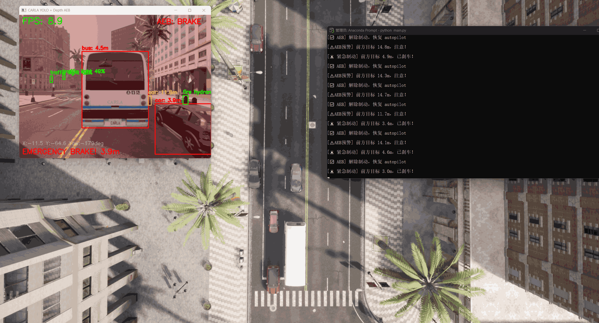

# 自动驾驶感知与控制系统研究 (基于 CARLA)

## 1. 项目简介

本项目旨在通过 Python 脚本与 CARLA 仿真环境进行深度交互，搭建一个基础的自动驾驶测试环境。项目将探索如何利用深度学习视觉算法和虚拟传感器数据，实现对仿真世界中动态物体的检测、环境感知以及基础的车辆控制。

## 2. 选题说明

* **参考开源项目:** [kamilkolo22/AutonomousVehicle](https://github.com/kamilkolo22/AutonomousVehicle)
* **重构思路:** 原项目部分模块对 Windows 系统兼容性较差，本项目提取其“视觉识别 + 传感器交互”的核心架构，在 Windows 环境下使用纯 Python 配合 PyTorch 进行完全重构，以确保跨平台的易用性和代码的可读性。

## 3. 开发运行环境

* **操作系统:** Windows 10/11
* **仿真平台:** HUTB CARLA_Mujoco_2.2.1
* **编程语言:** Python 3.8
* **核心框架:** PyTorch (支持 CUDA 加速), OpenCV
* **开发工具:** Visual Studio Code / Anaconda

## 4. 模块结构与入口

* 本模块的所有核心代码存放于 `src/carla_yolo_detection` 目录下。
* 模块的主程序入口为 `main.py`。

## 5.运行指南

### 步骤 1：启动 CARLA 模拟器

运行 `CarlaUE4.exe`，等待地图加载完毕。

### 步骤 2：配置 Python 环境

> **⚠️ 核心避坑**：本项目基于 HUTB CARLA_Mujoco_2.2.1，必须先手动安装模拟器自带的 `carla` 库，不能直接 pip install carla。

请在 Anaconda 环境（推荐 Python 3.8）中，**依次执行**以下命令：

1. **安装底层 CARLA API** (请将路径替换为你电脑上实际的 `.whl` 路径)：

   ```bash
   pip install D:\hutb\hutb_car_mujoco_2.2.1\PythonAPI\carla\dist\hutb-2.9.16-cp38-cp38-win_amd64.whl
   
   ```

2. 安装常规依赖库：
   ```pip install -r src/carla_yolo_detection/requirements.txt -i [https://pypi.tuna.tsinghua.edu.cn/simple](https://pypi.tuna.tsinghua.edu.cn/simple)```


3. **(可选) 开启 GPU 显卡加速**：
   如果你拥有 NVIDIA 显卡并希望获得 30+ 的流畅 FPS，请**务必额外执行**此命令覆盖安装 CUDA 版 Torch：

   ```bash
   pip install torch torchvision torchaudio --index-url [https://download.pytorch.org/whl/cu118](https://download.pytorch.org/whl/cu118)
   
   ```

步骤 3：运行程序
请在项目根目录下执行核心脚本：
```python src/carla_yolo_detection/main.py```

# [第2次提交] carla_yolo_detection: 实时感知与背景车流系统

## 1. 模块功能

本模块实现了自动驾驶视觉感知的基础闭环：

- **实时物体检测**: 集成 YOLOv5s 模型，实时识别 CARLA 环境中的车辆与行人。
- **背景交通流生成**: 利用 Traffic Manager 自动随机部署 30 辆背景车，模拟动态路况。
- **异步推理架构**: 优化了图像处理流程，通过回调截取最新帧，避免了深度学习推理导致的画面卡死，并支持实时 FPS 显示。
- **安全监听**: 挂载碰撞传感器 (Collision Sensor)，实时在终端发出碰撞预警。

## 2. 运行效果


---

#  [第3次提交] 前向测距与 AEB 自动紧急制动系统

## 1. 功能说明

在感知系统的基础上，本版本引入了决策与控制模块，实现了车辆的主动安全防护，并大幅优化了仿真体验：

* **多传感器同步与测距**：同步挂载 RGB 与 Depth 深度相机（统一 FOV 与 Transform）。利用 YOLO 提取目标框，映射至深度图取中值，实现了极具鲁棒性的抗噪前向测距。
* **三段式接管控制 (AEB)**：
  * `距离 > 15m (NORMAL)`：安全状态，车辆交由 Autopilot 自主巡航。
  * `5m < 距离 <= 15m (WARN)`：预警状态，终端提示注意前方目标。
  * `距离 <= 5m (BRAKE)`：危险状态，系统强行覆盖 Autopilot，油门归零、刹车拉满 (`brake=1.0`)，画面闪烁红色警报覆层。危险解除后自动恢复 Autopilot。
* **仿真环境深度优化 **：
  * **自动垃圾回收**：启动时自动销毁上次运行残留的车辆与传感器，杜绝幽灵碰撞。
  * **视角自动追踪**：初始化时自动将 CARLA 旁观者视角 (Spectator) 锁定至自车上方，告别手动找车的烦恼。
  * **HUD 增强显示**：新增自车实时全局坐标 (X, Y, Yaw) 与 AEB 状态指示灯的屏幕渲染。

## 2. 运行效果展示


*图：系统成功捕获前方小于5米的目标，瞬间夺取控制权触发 EMERGENCY BRAKE，并渲染红色全屏警报。*