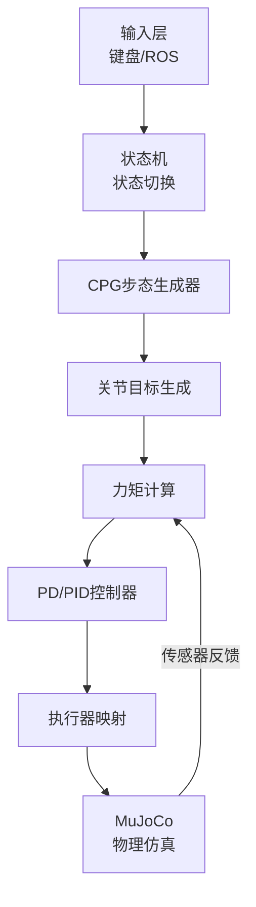
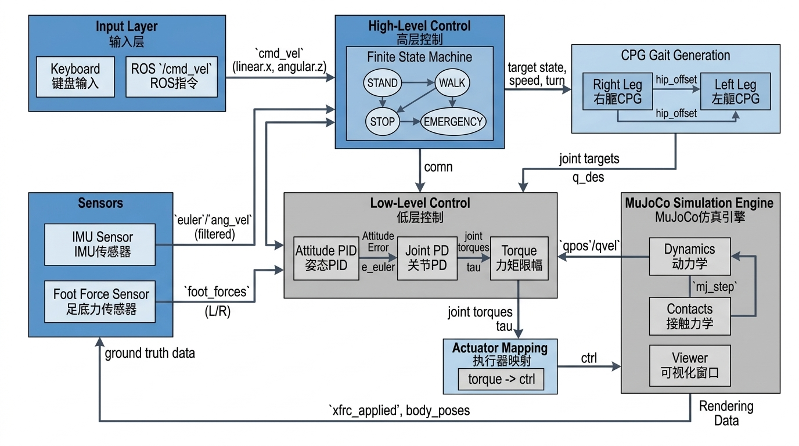
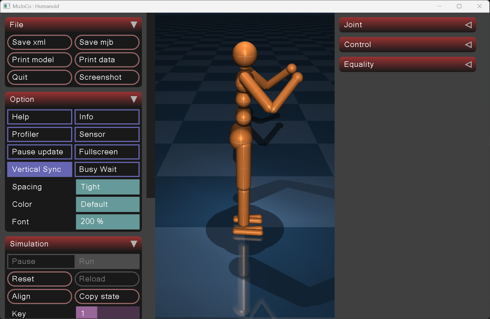
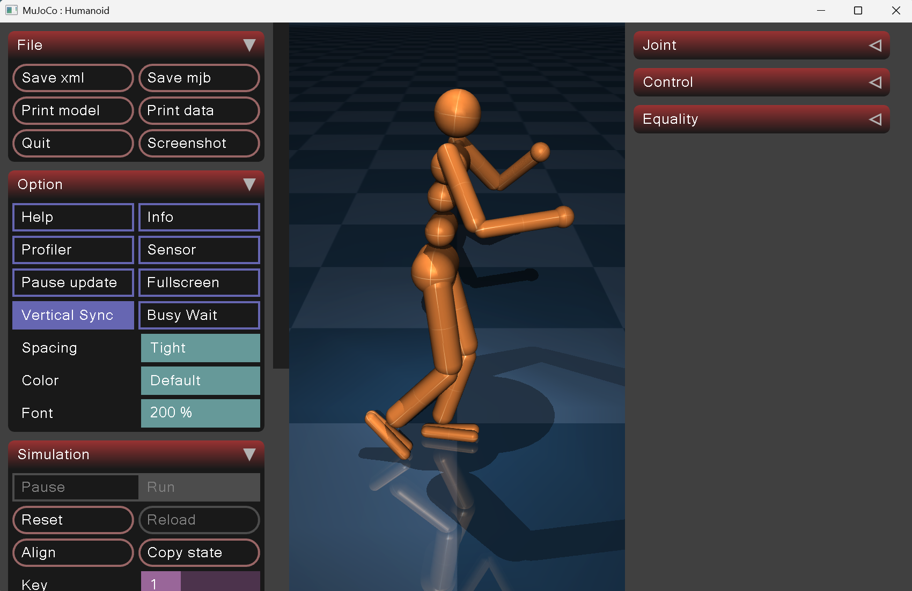

# 基于 CPG + PD 的人形机器人稳定站立与行走仿真（MuJoCo）

## 1.项目概述

### 1.1 项目简介

本项目面向简化人形机器人在 MuJoCo 物理仿真中的稳定站立与基础行走控制需求，采用 **"CPG 步态生成 + 基于 IMU 的姿态稳定（PD/PID）+ 足底接触反馈 + 初始化落地支撑"** 的组合式控制框架，在不依赖深度学习模型的前提下实现可交互的站立/行走演示，并支持键盘与 ROS `/cmd_vel` 实时控制。

项目在"关节索引映射、力矩到执行器控制映射、足底接触力计算、初始化落地支撑、跌倒恢复机制、输入兼容性与日志节流"等关键工程点上形成了稳定可运行的基线，最终实现 **"可运行、可复现、可继续向强化学习扩展"** 的最小闭环控制系统。

### 1.2 项目整体流程



该系统形成完整的机器人控制闭环：
输入 → 状态机 → 步态生成 → 姿态稳定 → actuator控制 → 仿真反馈

### 1.3 项目组成

| 模块     | 类/函数                                       | 功能                             |
| ------ | ------------------------------------------ | ------------------------------ |
| 输入处理模块 | `ROSCmdVelHandler`, `KeyboardInputHandler` | 键盘与 ROS 指令接收                   |
| 状态机模块  | `HumanoidStabilizer.state_map`             | STAND/WALK/STOP/EMERGENCY 状态管理 |
| 步态生成模块 | `CPGOscillator`                            | Van der Pol 振荡器步态生成            |
| 控制计算模块 | `_calculate_stabilizing_torques`           | 姿态 PID + 关节 PD 控制              |
| 执行器映射  | `_torques_to_ctrl`                         | 力矩 → actuator ctrl 转换          |
| 仿真主循环  | `simulate_stable_standing`                 | MuJoCo 仿真与可视化                  |

本项目的核心价值在于：**形成完整的人形机器人控制闭环，而非单一功能脚本**。

### 1.4 核心技术特点

| 特点       | 说明                                                   |
| :------- | :--------------------------------------------------- |
| **控制闭环** | 状态机 → CPG 关节目标 → PD 力矩 → actuator ctrl → MuJoCo step |
| **步态生成** | Van der Pol 振荡器 + 左右腿相位耦合                            |
| **姿态稳定** | 基于 IMU 的 Roll/Pitch PID + Yaw PD                     |
| **足底接触** | 实时接触力计算 + 自适应阈值                                      |
| **交互方式** | 键盘（W/A/S/D/1-4）+ ROS `/cmd_vel` 双通道                  |
| **跌倒处理** | 自动检测 + 恢复锁 + 冷却机制                                    |

### 1.5 运行环境与使用方式

#### 环境准备

```bash
pip install mujoco numpy
```

#### 运行演示（推荐入口）

```bash
python src/mujoco_manrun/main.py
```

#### ROS 接入（可选）

在 ROS 环境启动后发布 `/cmd_vel`：

```bash
rostopic pub /cmd_vel geometry_msgs/Twist "{linear: {x: 0.5}, angular: {z: 0.0}}"
```

### 1.6 项目核心目标

- **可运行性**：在 Windows 下无需 ROS 也能直接运行仿真；在 ROS 环境下支持 `/cmd_vel` 输入。
- **控制闭环完整性**：实现 “状态机 → CPG 关节目标 → PD 力矩 → actuator ctrl → MuJoCo step” 的端到端闭环。
- **稳定性工程化**：加入 IMU 滤波、足底接触力计算、初始化落地对齐、跌倒判定与恢复锁，降低开局瞬间摔倒概率。
- **可扩展性**：为后续“深度学习/强化学习（Residual RL / RL+CPG / RL+MPC）”提供清晰接口与观测-动作定义。

## 2. 项目背景与问题定义

### 2.1 背景

人形机器人具有高自由度、欠驱动、非线性强耦合特性，稳定站立与自然行走是机器人控制的基础难点。传统纯手工调参控制存在调试难、泛化差、易倾倒等问题，亟需在仿真环境搭建一套规则控制基线，为后续算法迭代与迁移奠定基础。

### 2.2 现存痛点

- 人形自由度高，关节耦合强，人工调参难度大；
- MuJoCo 关节 qpos/qvel 固定切片取值易发生索引错位；
- 关节力矩不能直接赋值给 ctrl，受 gear、ctrlrange 约束；
- 仿真初始接触未建立，机器人极易开局秒摔；
- 跌倒后无冷却锁，容易连续重复摔倒。
  基于这些问题，本项目选择使用 MuJoCo 物理仿真平台，采用 **CPG + PD** 的组合控制方案，通过程序自动生成步态，并通过迭代优化逐步提升稳定性。

### 2.3 项目建设目标

- **稳定站立**：机器人能够在仿真环境中自主保持平衡
- **基础行走**：支持多步态模式的周期性行走
- **实时交互**：支持键盘和 ROS 指令动态控制
- **工程化稳定性**：具备跌倒检测、自动恢复等鲁棒性机制
- **RL 扩展性**：为后续强化学习提供清晰接口

## 3. 核心技术栈与理论基础

本项目的技术栈比较清晰，可以分为仿真层、控制层、算法层和交互层四部分。

### 3.1 核心技术栈

| 技术类别   | 具体选型           | 说明               |
| :----- | :------------- | :--------------- |
| 物理仿真引擎 | MuJoCo 2.3+    | 连续动力学 + 刚体接触     |
| 数值计算   | NumPy          | 控制/滤波/向量化计算      |
| 交互输入   | Keyboard / ROS | 本地键盘 + 可选 ROS 接入 |
| 开发语言   | Python 3.8+    | 快速迭代与调试          |
| 人形模型   | 21自由度 XML      | 含腰部/双腿/双臂        |

上表概括了本项目最核心的开发与运行基础。围绕这些技术，项目进一步形成了 **"输入-控制-仿真"** 三段式工程闭环。

### 3.2 仿真层：MuJoCo

MuJoCo（Multi-Joint Dynamics with Contact）是一个面向机器人控制的物理仿真引擎，支持：

- 刚体动力学与接触建模
- 高精度物理仿真
- Python API 脚本控制
- 被动式可视化 Viewer

在本项目中，MuJoCo 主要承担三个作用：

- 提供人形机器人的物理仿真环境
- 提供关节状态（qpos/qvel）和接触力反馈
- 执行控制指令（ctrl）并更新世界状态

相关代码位置：

- MuJoCo 模型加载：HumanoidStabilizer.__init__(main.py#L234-L242)
- 仿真主循环：simulate\_stable\_standing(main.py#L856-L928)
- 物理步进：mujoco.mj_step（见 (main.py#L883)、(main.py#L904)）

### 3.3 控制层：状态机与执行器映射

`HumanoidStabilizer` 实现了完整的状态机控制逻辑：

| 状态        | 触发条件            | 行为            |
| --------- | --------------- | ------------- |
| STAND     | 初始化 / 复位 / 跌倒恢复 | 保持直立姿态        |
| WALK      | 按 w / ROS 速度指令  | CPG 步态生成 + 行走 |
| STOP      | 按 s / 低速停止      | 减速停稳          |
| EMERGENCY | 按 e             | 立即停止，清空控制     |

执行器映射是控制层的核心难点。MuJoCo 的 actuator ctrl 受 `gear` 和 `ctrlrange` 约束，不能直接写入力矩。解决方案如下：

```python
def _torques_to_ctrl(self, joint_torques):
    ctrl = np.zeros(self.model.nu, dtype=np.float64)
    for joint_name in self.joint_names:
        joint_idx = self.joint_name_to_idx[joint_name]
        actuator_id = self._actuator_id_by_joint[joint_name]
        gear = float(self._actuator_gear_by_joint[joint_name])
        ctrl_min, ctrl_max = self._actuator_ctrlrange_by_joint[joint_name]
        max_torque = max(abs(ctrl_min), abs(ctrl_max)) * max(gear, 1e-9)
        torque = float(np.clip(joint_torques[joint_idx], -max_torque, max_torque))
        ctrl_val = torque / max(gear, 1e-9)
        ctrl[actuator_id] = float(np.clip(ctrl_val, ctrl_min, ctrl_max))
    return ctrl
```

对应代码：HumanoidStabilizer.\_torques\_to\_ctrl(main.py#L400-L411)

### 3.4 控制算法与运动学基础

本项目采用 **CPG 步态生成 + 姿态 PID + 关节 PD + 足底接触反馈** 的分层控制架构，整体分为三层：
**高层状态机 → 步态生成 → 低层稳定控制**，形成完整控制闭环。

#### 3.4.1 高层状态机

状态机负责控制模式切换，决定机器人执行站立、行走、停止或紧急停机行为，是整个系统的调度核心。

```python
self.state = "STAND"
self.state_map = {
    "STAND": self._state_stand,
    "WALK": self._state_walk,
    "STOP": self._state_stop,
    "EMERGENCY": self._state_emergency
}
```

对应代码：HumanoidStabilizer.state\_map(main.py#L352-L357)。

#### 3.4.2 CPG 振荡器（Van der Pol + 相位耦合）

CPG（Central Pattern Generator）通过耦合振荡器生成周期性节律信号，模拟生物行走步态。
数学模型：
```text
x\_dot = 2π f · y + k · sin(φ\_tar - φ)
y\_dot = 2π f · ( μ(1 - x^2) · y - x )
```
**参数说明：**
- $\phi = \text{atan2}(x, y)$：当前相位
- $k$：左右腿相位耦合强度
- 输出步态信号：$u = A \cdot x$

**双腿相位耦合规则：**
- 右腿初始相位：$0$
- 左腿初始相位：$\pi$（反相交替迈步）

系统可根据行走速度与转向角度，自适应调节步态振幅与相位耦合强度。
对应代码：CPGOscillator.update(main.py#L207-L217)

#### 3.4.3 步态耦合策略

由 CPG 输出髋关节偏移，通过固定比例耦合生成膝关节与踝关节目标角度：

```python
self.joint_targets["hip_y_right"] = 0.0 + right_hip_offset
self.joint_targets["knee_right"] = 0.0 - right_hip_offset * 1.2
self.joint_targets["ankle_y_right"] = 0.0 + right_hip_offset * 0.5
```

实现自然交替迈步的步态联动。
对应代码：HumanoidStabilizer.\_state\_walk(main.py#L588-L642)

#### 3.4.4 关节空间 PD 跟踪控制

对每个关节执行独立的位置闭环，实现关节目标跟踪：
实现关节目标跟踪：

$$
\tau_i = K_{p,i} \cdot (q_{des,i} - q_i) - K_{d,i} \cdot \dot{q}_i
$$

系统根据足...
系统根据足底接触力动态调整 PD 增益：
- 支撑相：增大刚度，提升稳定性
- 摆动相：降低刚度，使动作更柔顺
对应代码：HumanoidStabilizer.\_calculate\_stabilizing\_torques(main.py#L743-L755)

#### 3.4.5 躯干姿态 PID 控制（Roll/Pitch）

以 IMU 欧拉角与角速度为反馈，对躯干姿态进行闭环稳定，Roll/Pitch 加入积分项抑制漂移：

$$
\begin{aligned}
\tau_{roll} &= K_p \cdot e_{roll} + K_d \cdot (-\omega_{roll}) + K_i \int e_{roll} \, dt \\
\tau_{pitch} &= K_p \cdot e_{pitch} + K_d \cdot (-\omega_{pitch}) + K_i \int e_{pitch} \, dt
\end{aligned}
$$

保证机器人在站立与行走过程中不倾倒。

对应代码：HumanoidStabilizer.\_calculate\_stabilizing\_torques(main.py#L743-L755)

#### 3.4.6 足底接触力计算

遍历 MuJoCo 接触队列，筛选足底几何并累加接触力，用于支撑相判断与刚度自适应：

$$
F_{foot} = \sum_{c \in \mathcal{C}_{foot}} \lVert \mathbf{f}_c \rVert_2
$$

其中 $\mathbf{f}_c$ 为接触点三维力。

对应代码：HumanoidStabilizer.\_compute\_foot\_forces(main.py#L701-L718)：

### 3.5 工程化机制

#### 初始化落地支撑

仿真开局时，机器人接触未建立，容易瞬间跌落。解决方案是对躯干施加短时辅助力：

$$
\begin{aligned}
F_z &= \mathrm{clip}\Big(F_{base} + 2000 \cdot (z_{ref} - z) - 200 \cdot \dot{z}, \; 0, \; 1.2 \cdot W \Big) \\
\tau_x &= -120 \cdot roll - 30 \cdot \omega_{roll} \\
\tau_y &= -120 \cdot pitch - 30 \cdot \omega_{pitch}
\end{aligned}
$$

对应代码：main.py:L760-L772

#### 跌倒检测与恢复

跌倒检测恢复：通过重心高度与躯干倾角判定摔倒，触发复位并设置冷却时间，防止连续摔倒。

```python
if com[2] < 0.25 or (com[2] < 0.4 and tilt > 0.6):
    self.set_state("STAND")
    self._fall_cooldown_until = time + 2.0
    self._recovery_until = time + 2.0
```

对应代码：main.py:L906-L921

### 3.6 关键优化手段（工程化）

| 优化手段     | 实现逻辑                             | 作用         |
| :------- | :------------------------------- | :--------- |
| 初始化落地对齐  | 复位时把关节目标写入 `qpos` 并 `mj_forward` | 降低初始误差与大冲击 |
| 起步软启动    | 逐步放大 torque\_scale               | 降低首秒冲击与摔倒  |
| IMU 低通滤波 | 一阶滤波 + 角速度限幅                     | 降低噪声引发的抖动  |
| 外力支撑     | `xfrc_applied` 高度 PD + 扶正力矩      | 度过接触未建立阶段  |
| 跌倒恢复锁    | cooldown + recovery window       | 抑制连摔与状态抖动  |

## 4. 系统整体架构
图 1 人形机器人控制整体架构图


本项目的控制闭环包含输入层、高层状态机、CPG 步态生成、低阶 PD/PID 控制、执行器映射、MuJoCo 仿真与传感器反馈七大模块，形成完整的状态机 - 步态 - 控制 - 仿真闭环。

## 5 系统优化

### 5.1 优化一：异步交互优化：引入键盘与 ROS 双线程，提升交互性

在原始版本中，输入与仿真线程冲突，且无 ROS 时无法运行。项目通过双线程解决：

```python
# ROS 线程
class ROSCmdVelHandler(threading.Thread):
    def __init__(self, stabilizer):
        self.sub = self.rospy.Subscriber("/cmd_vel", Twist, self._cmd_vel_callback)

# 键盘线程
class KeyboardInputHandler(threading.Thread):
    def __init__(self, stabilizer):
        # 读取键盘输入
```

对应代码：ROSCmdVelHandler(main.py#L12-L88)、KeyboardInputHandler(main.py#L91-L193)

优化作用：

- 支持 Windows/Linux 跨平台
- ROS 环境自动启用，无 ROS 时降级为键盘控制
- 输入与仿真解耦，不阻塞主循环

### 5.2 优化二：控制映射优化：力矩 → actuator ctrl 正确映射

原始版本直接将力矩写入 data.ctrl，导致控制无效。这是因为 MuJoCo 的 actuator 受 gear 和 ctrlrange 约束。

核心代码：

```python
def _torques_to_ctrl(self, joint_torques):
    for joint_name in self.joint_names:
        gear = self._actuator_gear_by_joint[joint_name]
        ctrl_min, ctrl_max = self._actuator_ctrlrange_by_joint[joint_name]
        max_torque = max(abs(ctrl_min), abs(ctrl_max)) * max(gear, 1e-9)
        torque = np.clip(joint_torques[idx], -max_torque, max_torque)
        ctrl_val = torque / max(gear, 1e-9)
        ctrl[actuator_id] = np.clip(ctrl_val, ctrl_min, ctrl_max)
```

对应代码：HumanoidStabilizer.\_torques\_to\_ctrl(main.py#L400-L411)

优化作用：

- 力矩能正确传递到执行器
- 避免控制饱和或无效
- 保证关节有足够驱动力

### 5.3 优化三：按关节名映射 qpos/qvel 地址

原始版本使用固定切片读取关节状态，在不同模型中容易错位。项目通过 jnt\_qposadr/jnt\_dofadr 建立地址映射：

```python
for joint_name in self.joint_names:
    joint_id = mujoco.mj_name2id(self.model, mjtObj.mjOBJ_JOINT, joint_name)
    self._qpos_adr[joint_idx] = int(self.model.jnt_qposadr[joint_id])
    self._qvel_adr[joint_idx] = int(self.model.jnt_dofadr[joint_id])

def _get_joint_positions(self):
    return self.data.qpos[self._qpos_adr].astype(np.float64, copy=True)
```

对应代码：main.py:L276-L285、main.py:L394-L399

优化作用：

- 彻底解决关节索引错位问题
- 模型修改后无需调整代码
- 控制发散大幅减少

### 5.4 优化四：笔挺站姿纠正

原始版本膝盖弯曲 -0.4 rad，导致重心严重偏前。项目改为完全直立：

```python
# 原先：膝盖弯曲
self.joint_targets["knee_right"] = -0.4

# 优化后：笔挺站姿
self.joint_targets["knee_right"] = 0.0
self.joint_targets["ankle_y_right"] = 0.0
```

对应代码：main.py:L431-L475

优化作用：

- 重力自然贯穿腿骨
- 站立稳定性大幅提升

### 5.5 优化五：初始化落地支撑

开局时足底接触未建立，机器人容易瞬间跌落。项目添加了短时辅助力：

```python
if now_t < self._support_until:
    scale = clip((self._support_until - now_t) / self._support_duration, 0, 1)
    z_error = self._support_com_z - com_z
    up_force = clip(baseline + 2000*z_error - 200*z_vel, 0, self.weight*1.2)
    self.data.xfrc_applied[self._support_body_id, 2] = up_force * (scale * scale)
```

对应代码：main.py:L760-L772

优化作用：

- 平稳度过接触未建立阶段
- 辅助力随时间平滑衰减，不干扰正常控制

### 5.6 优化六：多步态模式配置

项目支持 4 种步态模式，通过按键 1-4 切换：

```python
self.gait_config = {
    "SLOW": {"freq": 0.3, "amp": 0.3, "speed_freq_gain": 0.2, "speed_amp_gain": 0.1},
    "NORMAL": {"freq": 0.5, "amp": 0.4, "speed_freq_gain": 0.4, "speed_amp_gain": 0.2},
    "TROT": {"freq": 0.8, "amp": 0.5, "speed_freq_gain": 0.5, "speed_amp_gain": 0.3},
    "STEP_IN_PLACE": {"freq": 0.4, "amp": 0.2, "speed_freq_gain": 0.0, "speed_amp_gain": 0.0}
}
```

对应代码：main.py:L319-L326、main.py:L413-L428

优化作用：

- 支持不同行走速度与风格
- 便于步态参数对比实验
- 为后续 RL 提供动作空间参考

### 5.7 优化七：足底力反馈与刚度调节

基于足底力动态调节关节 PD 增益，支撑相增加刚度，摆动相降低刚度：

```python
force_factor = clip(foot_force / (0.5 * weight), 0.4, 1.1)
kp = base_kp * force_factor
kd = base_kd * force_factor

# 摆动相降低刚度
if foot_contact == 0:
    kp *= 0.8
    kd *= 0.9
```

对应代码：main.py:L795-L812

优化作用：

- 支撑相更稳定，摆动相更柔顺
- 减少足底冲击
- 提升复杂地形适应性

### 5.8 优化八：跌倒检测与恢复锁

添加跌倒自动检测和恢复机制，防止连摔：

```python
if com[2] < 0.25 or (com[2] < 0.4 and tilt > 0.6):
    self._fall_count += 1
    self.set_state("STAND")
    self._fall_cooldown_until = time + 2.0
    self._recovery_until = time + 2.0

# 冷却期间禁止进入 WALK
if state == "WALK" and self.data.time < self._recovery_until:
    return
```

对应代码：main.py:L906-L921、main.py:L652-L659

优化作用：

- 摔倒后自动恢复
- 冷却窗口防止连摔

### 5.9 优化九：扭矩软启动

起步阶段扭矩从 0.5 平滑提升至 1.0，减少冲击：

```python
alpha = min(1.0, elapsed / 1.0)
torque_scale = 0.5 + 0.5 * alpha
torques = self._calculate_stabilizing_torques() * torque_scale
```

对应代码：main.py:L875-L887

优化作用：

- 减少起步冲击
- 降低起步摔倒概率
- 动作更平滑自然

### 5.10 优化十：日志节流与观测优化

高频调试输出改为时间间隔触发，避免刷屏：

```python
def _should_log(self, key, interval_s):
    now = float(self.data.time)
    last = float(self._log_last.get(key, -1e9))
    if (now - last) >= float(interval_s):
        self._log_last[key] = now
        return True
    return False
```

对应代码：main.py:L386-L392

优化作用：

- 控制台可读性提升
- 降低 I/O 开销
- 便于长时间运行观测

## 6. 核心技术难点与解决历程

### 6.1 qpos/qvel 索引错位导致控制发散

- **问题本质**：MuJoCo 的关节在 `qpos/qvel` 中的布局依赖模型定义，不能用固定切片假设。
- **解决方案**：通过 `jnt_qposadr/jnt_dofadr` 建立地址表并统一访问 HumanoidStabilizer.__init__(main.py#L276-L285)。

### 6.2 力矩直接写 ctrl 导致控制无效

- **问题本质**：actuator 的 `ctrl` 受 gear、ctrlrange 限制，需进行反解与限幅。
- **解决方案**：实现 torque→ctrl 映射 HumanoidStabilizer.\_torques\_to\_ctrl(main.py#L400-L411)。

### 6.3 足底接触误判与“偶发为 0”

- **问题本质**：接触需要遍历 `data.ncon` 并使用 `mj_contactForce` 才能得到每个接触对的力。
- **解决方案**：以足底 geom 集合筛选接触并累加力范数 HumanoidStabilizer.\_compute\_foot\_forces(main.py#L701-L718)；在初始化支撑期直接输出 true force，避免延迟缓冲造成的“零值” HumanoidStabilizer.\_simulate\_foot\_force\_data(main.py#L518-L548)。

### 6.4 开局“秒摔”与复位后连摔

- **问题本质**：落地接触未建立时系统处于欠约束；复位后立刻切 WALK 容易重复摔倒。
- **解决方案**：外力支撑窗口 + 跌倒恢复锁 HumanoidStabilizer.\_calculate\_stabilizing\_torques(main.py#L760-L772)、[simulate\_stable\_standing](main.py#L906-L921)。

## 7. 系统运行效果

### 7.1 运行环境配置

| 类别 | 配置                        |
| -- | ------------------------- |
| 系统 | Windows 11 / Ubuntu 20.04 |
| 仿真 | MuJoCo 2.3+               |
| 依赖 | Python3.8、NumPy、threading |
| 可选 | ROS 环境支持 /cmd\_vel        |

### 7.2 键盘控制说明

| 按键  | 功能      |
| --- | ------- |
| W   | 开始行走    |
| S   | 停止站立    |
| A/D | 左右转向    |
| Z/X | 加减速     |
| 1-4 | 切换步态    |
| E   | 紧急停止    |
| R   | 复位直立    |
| M   | 传感器噪声开关 |

### 7.3 运行结果图片
图 2 机器人稳定站立仿真效果

图 3 机器人周期行走仿真效果


## 8. 现存不足与后续优化方向

### 8.1 现存不足

- **步态仍依赖手工参数**：CPG 振幅、耦合、髋-膝-踝比例需要人工调参，泛化性有限。
- **稳定性边界仍较窄**：较大扰动或高速度下仍可能前倾/侧倒。
- **观测与奖励尚未体系化**：若要引入 RL，需要系统化定义观测向量、奖励函数与训练课程。

### 8.2 后续优化方向

- **残差强化学习 Residual RL**：保留现有 CPG+PD 稳定基线，RL 学习关节目标残差修正量，不用从零训练，收敛更快、鲁棒性更强。
- **端到端 PPO/SAC**：强化学习设计速度跟踪、姿态稳定、能耗惩罚、足底接触合理性多维度奖励，采用站立→小步→行走→扰动对抗课程学习。
- **模仿学习初始化**：以现有规则控制器生成高质量轨迹，行为克隆初始化策略，再 RL 微调。
- **域随机化与 Sim2Real**：随机化摩擦、质量、关节阻尼、IMU 噪声与延迟，提升仿真策略泛化性，为迁移真实机器人做准备。

## 9. 总结

本项目基于 MuJoCo 搭建CPG+PD/PID人形机器人控制框架，完成从输入交互、状态调度、步态生成、姿态稳定到仿真闭环的全链路实现。解决了关节索引、执行器映射、开局摔倒、跌倒自恢复等关键工程问题，实现稳定站立与多模式可交互行走。
系统具备良好工程可复现性与算法扩展性，既可以作为规则控制基线，也可直接对接残差强化学习、模仿学习与 Sim2Real 迁移研究，为人形机器人后续高级运动控制奠定完整基础。

项目代码位置：src/mujoco\_manrun/main.py
模型文件位置：src/mujoco\_manrun/models/humanoid.xml

## 参考文献
[1] 刘成举。基于自学习 CPG 的仿人机器人自适应行走控制 [J]. 自动化学报，2021, 47 (8): 1652-1661.
[2] Todorov E, Erez T, Tassa Y. MuJoCo: A physics engine for model-based control[C]//2012 IEEE/RSJ International Conference on Intelligent Robots and Systems. IEEE, 2012: 5026-5033.
