# 基于栅格地图与多算法对比的机器人自主导航仿真系统

## 摘要

本项目围绕移动机器人自主导航这一经典问题，构建了一套基于二维栅格地图的轻量级导航仿真系统。系统从环境建模、全局路径规划、动态障碍插入、在线重规划、轨迹平滑到可视化分析形成了完整闭环，并进一步引入多算法对比评测机制，对 `A*`、`Dijkstra`、`Greedy Best-First` 与 `RRT*` 等方法在同一环境中的表现进行统一分析。针对传统项目“只给出一条路径、缺少动态响应与实验对比”的不足，项目在原始路径规划基础上增加了动态重规划、批量地图实验、轨迹平滑、简易运动学约束与交互式二维仿真界面等改进，使系统既能演示导航过程，又能支撑定量实验分析。

## 1. 项目背景与研究动机

自主导航是移动机器人系统中的基础能力之一，其目标是在已知或部分已知环境中，从起点出发到达目标点，同时满足安全性、可达性和效率要求。在工程实践中，这一问题通常不是单一的“最短路径搜索”，而是由以下多个子问题共同构成：

- 环境中存在随机分布的障碍物，且障碍物会改变可通行区域。
- 机器人在运动过程中可能遇到新的动态障碍，需要在线更新路径。
- 不同规划算法在路径代价、搜索效率与鲁棒性上存在明显差异。
- 原始栅格路径通常具有较多折线转折，不适合直接作为执行轨迹。

因此，本项目将经典路径规划问题拓展为一个集 **环境建模、导航仿真、动态重规划、轨迹优化和多算法评估** 于一体的综合系统。相比只输出一条规划路径的基础作业版本，这一系统更接近机器人导航算法的原型验证流程。

## 2. 问题建模

### 2.1 栅格地图建模

设导航环境离散化为一个二维栅格地图：

\[
\mathcal{G} = \{g_{ij} \mid 1 \le i \le M,\ 1 \le j \le N\}
\]

其中：

- \(g_{ij}=0\) 表示该栅格可通行；
- \(g_{ij}=1\) 表示该栅格为障碍物；
- \(M,N\) 分别表示地图行数和列数。

机器人起点记为：

\[
s = (x_s, y_s)
\]

目标点记为：

\[
t = (x_t, y_t)
\]

则路径规划问题可定义为在栅格图 \(\mathcal{G}\) 中求解一条从 \(s\) 到 \(t\) 的可行路径：

\[
P = \{p_0, p_1, \dots, p_k\}, \quad p_0 = s,\ p_k = t
\]

并使其总代价最小：

\[
J(P) = \sum_{i=0}^{k-1} c(p_i, p_{i+1})
\]

其中 \(c(p_i, p_{i+1})\) 为相邻路径点之间的移动代价。

### 2.2 导航目标

本项目的导航目标不仅是获得一条可达路径，还包括：

- 保证路径避开静态和动态障碍物；
- 在环境变化后快速完成重规划；
- 尽可能降低路径总代价；
- 减少无效扩展节点数，提升搜索效率；
- 通过平滑处理提高轨迹连续性与可执行性。

## 3. 技术基础与系统设计

本项目采用轻量级二维仿真方案实现导航流程，避免对大型三维平台的依赖，同时保留算法验证与实验分析所需的关键能力。需要说明的是，本文中的“仿真”指基于二维栅格地图和可视化动画的算法级仿真，整体系统由以下几个部分构成。

### 3.1 环境建模模块

- 使用二维栅格地图表示导航环境。
- 地图边界设置为封闭区域，防止机器人越界。
- 支持随机障碍生成，并保留起点和终点周围的缓冲区域。
- 支持运行过程中插入动态障碍，用于触发在线重规划。

### 3.2 路径规划模块

系统统一实现并接入了多种经典规划算法：

- `A*`
- `Dijkstra`
- `Greedy Best-First`
- `RRT*`

这些方法共享同一地图输入、起终点设置和代价评估标准，因此适合进行公平对比。

### 3.3 动态障碍与在线重规划模块

当机器人沿路径前进时，系统会在预设步数后向前方路径中插入一个动态障碍物。若新障碍阻断当前剩余路径，则触发重规划。其逻辑可表述为：

\[
\text{if } p_i \in \mathcal{O}_{dyn}, \text{ then replan}(p_{cur}, t)
\]

其中：

- \(p_i\) 为当前剩余路径中的某个节点；
- \(\mathcal{O}_{dyn}\) 表示动态障碍集合；
- \(p_{cur}\) 表示机器人当前位置。

### 3.4 轨迹平滑与运动学约束模块

原始路径为离散折线路径，难以直接用于连续控制。为此项目引入两级轨迹优化：

1. **路径平滑**：通过视线可达性（Line-of-Sight）检查，删除冗余中间节点。
2. **运动学轨迹生成**：设置最大转向角与固定步长，生成更接近机器人实际转向行为的轨迹。

### 3.5 可视化与批量评测模块

为了避免项目停留在“单次运行截图”的层面，系统额外构建了可视化与批量评测模块。该模块主要负责：

- 自动保存单次实验静态图、对比图和导航动图；
- 生成多张随机地图并重复运行多种算法；
- 汇总成功率、平均路径代价、平均扩展节点数和平均运行时间；
- 自动选出综合表现最优的方法，并输出最终展示结果。

若记算法集合为：

\[
\mathcal{A}=\{\text{A*},\ \text{Dijkstra},\ \text{Greedy},\ \text{RRT*}\}
\]

测试地图集合为：

\[
\mathcal{M}=\{M_1, M_2, \dots, M_K\}
\]

则系统对每个算法 \(a \in \mathcal{A}\) 和每张地图 \(M_k \in \mathcal{M}\) 计算一组指标向量：

\[
\mathbf{z}_{a,k} = [S_{a,k},\ J_{a,k},\ R_{a,k},\ E_{a,k},\ T_{a,k}]
\]

其中分别对应成功标记、路径代价、重规划次数、扩展节点数和运行时间。最终再按平均表现与获胜次数完成综合排序。

## 4. 核心算法原理

### 4.1 A* 算法

A* 算法通过累计代价与启发式代价共同评价节点：

\[
f(n) = g(n) + h(n)
\]

其中：

- \(g(n)\)：起点到当前节点 \(n\) 的实际累计代价；
- \(h(n)\)：当前节点到目标点的启发式估计代价；
- \(f(n)\)：综合优先级。

在本项目中，启发式函数采用曼哈顿距离：

\[
h(n) = |x_n - x_t| + |y_n - y_t|
\]

该方法在保证搜索方向性的同时，能兼顾较好的路径质量与搜索效率。

### 4.2 Dijkstra 算法

Dijkstra 算法本质上是没有启发式项的单源最短路径搜索，其评价仅依赖实际代价：

\[
f(n) = g(n)
\]

其优点是最优性稳定，缺点是搜索空间大，往往会扩展更多节点。在障碍较多或地图规模更大时，其时间开销通常高于 A*。

### 4.3 Greedy Best-First 算法

Greedy Best-First 只考虑启发式距离：

\[
f(n) = h(n)
\]

因此它倾向于“朝目标方向快速搜索”。这种策略能显著降低扩展节点数与运行时间，但可能忽略局部绕障成本，从而产生更长的最终路径。

### 4.4 RRT* 算法

RRT* 属于采样式规划方法，通过在自由空间中随机采样、逐步生长搜索树并进行重连优化，构建一条近似最优路径。其基本思想包括：

1. 随机采样点 \(x_{rand}\)；
2. 在当前树中寻找最近节点 \(x_{near}\)；
3. 沿 \(x_{near}\) 向 \(x_{rand}\) 扩展得到新节点 \(x_{new}\)；
4. 在邻域内寻找更优父节点并尝试重连。

其局部代价更新可写为：

\[
J(x_{new}) = J(x_{parent}) + \|x_{new} - x_{parent}\|
\]

RRT* 在大尺度连续空间中具有较好适应性，但在小尺寸离散栅格地图中未必总能优于 A*，这也是本项目将其纳入对比实验的重要原因。

### 4.5 动态重规划触发机制

机器人在执行过程中并不是“先规划一次然后机械执行到底”，而是会持续检查剩余路径是否仍然有效。若剩余路径记为：

\[
P_{rem}=\{p_c, p_{c+1}, \dots, p_k\}
\]

动态障碍集合记为 \(\mathcal{O}_{dyn}\)，则当存在：

\[
\exists p_i \in P_{rem},\quad p_i \in \mathcal{O}_{dyn}
\]

时，系统判定当前路径失效，并以当前位置 \(p_c\) 为新起点重新调用规划器求解：

\[
P_{new} = \text{Plan}(p_c, t, \mathcal{G}')
\]

其中 \(\mathcal{G}'\) 表示插入新障碍后的地图。该机制保证了系统具备基本的在线响应能力。

## 5. 路径平滑与运动学约束

### 5.1 路径平滑

设原始路径为：

\[
P = \{p_0, p_1, \dots, p_k\}
\]

若节点 \(p_i\) 与 \(p_j\) 之间满足视线可达性，则可删除中间冗余节点，得到更短的路径表示：

\[
P' = \{p_0, p_{i_1}, p_{i_2}, \dots, p_k\}
\]

该步骤的核心目标是减少折线拐点数，从而降低后续轨迹的离散程度。

### 5.2 运动学约束轨迹

考虑机器人在离散仿真中不能无限快改变朝向，因此设置最大转角约束：

\[
|\Delta \theta| \le \theta_{max}
\]

同时设置固定步长 \(\Delta s\)，则下一时刻位置更新为：

\[
x_{k+1} = x_k + \Delta s \cdot \cos(\theta_k)
\]

\[
y_{k+1} = y_k + \Delta s \cdot \sin(\theta_k)
\]

这一处理使轨迹从“折线段集合”转变为“连续转向轨迹”，更接近真实机器人执行状态。

## 6. 评价指标设计

为了对不同算法进行公平比较，本项目定义了以下指标：

### 6.1 成功率

若机器人最终到达目标点，则记为成功。设总实验次数为 \(N\)，成功次数为 \(N_s\)，则成功率为：

\[
\text{Success Rate} = \frac{N_s}{N}
\]

### 6.2 路径总代价

路径总代价定义为路径上相邻节点之间欧氏距离之和：

\[
J(P) = \sum_{i=0}^{k-1} \|p_{i+1} - p_i\|
\]

总代价越低，说明路径越短或越高效。

### 6.3 重规划次数

当动态障碍阻塞路径并触发一次新规划时，计数加一。该指标反映算法在动态环境中的响应频度。

### 6.4 扩展节点数

扩展节点数表示规划过程中被访问并展开的节点总数。该值越大，通常意味着搜索开销越高。

### 6.5 运行时间

运行时间记为一次规划与导航模拟的总耗时：

\[
T = t_{end} - t_{start}
\]

该指标反映算法的实时性。

### 6.6 综合评分思想

为便于从多张地图中选出“表现最均衡”的算法，系统采用“先成功、再代价、再效率”的排序逻辑。可将其抽象为一个加权评分函数：

\[
\text{Score}(a)=\alpha \cdot \overline{S}_a-\beta \cdot \overline{J}_a-\gamma \cdot \overline{E}_a-\delta \cdot \overline{T}_a
\]

其中：

- \(\overline{S}_a\) 为算法 \(a\) 的平均成功率；
- \(\overline{J}_a\) 为平均路径代价；
- \(\overline{E}_a\) 为平均扩展节点数；
- \(\overline{T}_a\) 为平均运行时间；
- \(\alpha,\beta,\gamma,\delta > 0\) 为权重系数。

在当前实现中，程序实际采用的是分层优先级规则，但从实验报告角度看，上式能够更清楚地表达“为什么最终会优先选择 A*”。

## 7. 项目主要改进点

相较于只完成单次 A* 路径搜索的基础版本，本项目主要做了以下改进：

### 7.1 从单算法扩展到多算法对比

系统不仅能生成一条路径，还会在同一张地图上并行评测多种算法，并统计每种算法的：

- 是否成功到达
- 路径总代价
- 重规划次数
- 扩展节点数
- 运行时间

这使项目从“功能实现”升级为“实验评测平台”。

### 7.2 过程增强与实验扩展

相比只输出一条静态路径的基础版本，当前系统在三个层面完成了明显扩展。首先，在导航执行层面，系统支持在机器人运动过程中插入动态障碍并触发在线重规划，因此导航过程不再停留在“起点到终点的一次性搜索”，而是具备了连续决策与路径修正能力。其次，在轨迹表达层面，项目在原始离散折线路径基础上加入了平滑处理与简易运动学约束，使输出结果不仅能够回答“是否能到达目标”，还能够进一步说明“生成的路径是否更适合执行”。最后，在实验评估层面，系统从单地图演示扩展为多地图批量测试，能够自动统计不同算法在多组环境下的成功率、路径代价、扩展节点数和运行时间，并据此生成批量对比图。

在展示方式上，项目也从静态图进一步扩展到了动态演示与交互式验证。一方面，程序会自动导出导航过程动图，用于展示动态障碍出现、路径失效和重规划恢复的全过程；另一方面，系统提供了一个二维交互入口，允许用户通过鼠标修改障碍布局、通过键盘切换算法并实时观察结果变化。需要强调的是，这里的“交互式仿真”仍属于自建二维栅格环境中的算法级验证，而不是真实机器人平台或三维物理仿真器中的联调实验。

## 8. 仿真流程与核心结果

### 8.1 地图与障碍分布

下图展示了单次导航实验中的栅格地图与障碍物分布。黑色区域表示障碍物，绿色方块为起点，红色星形为目标点。

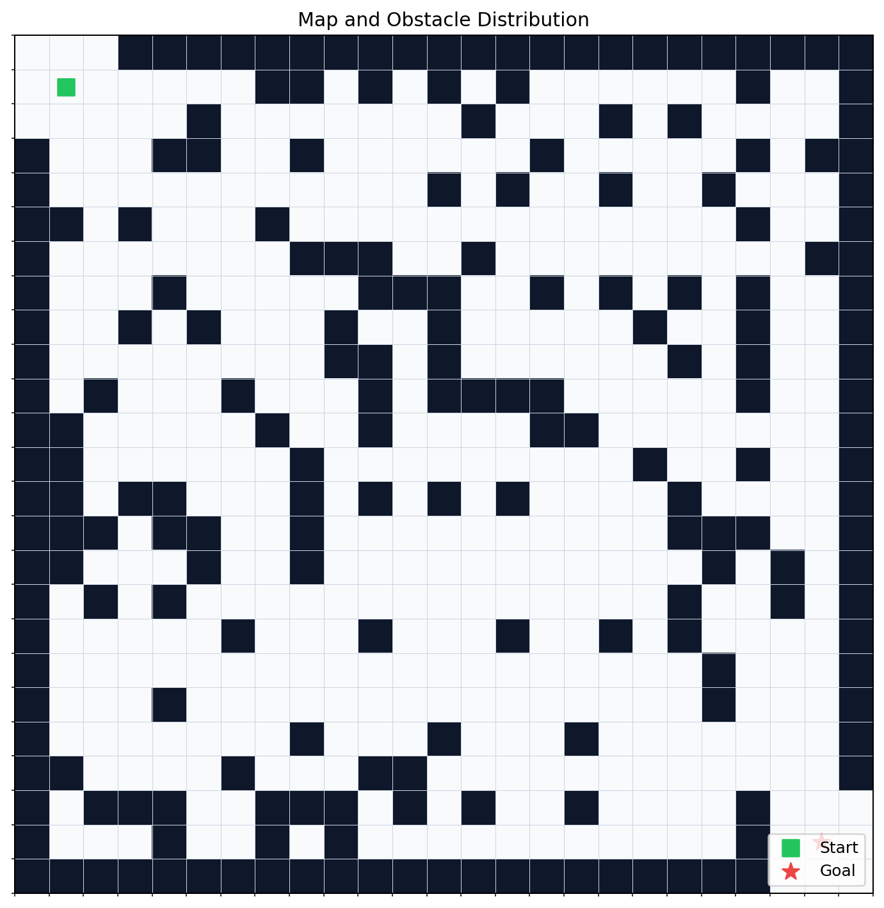

*图 8.1：二维栅格环境中的障碍分布与起终点设置。*

### 8.2 初始路径与重规划路径

在机器人运动过程中，系统会向路径前方插入动态障碍物，并触发重规划。下图展示了初始规划路径与重规划路径之间的差异。

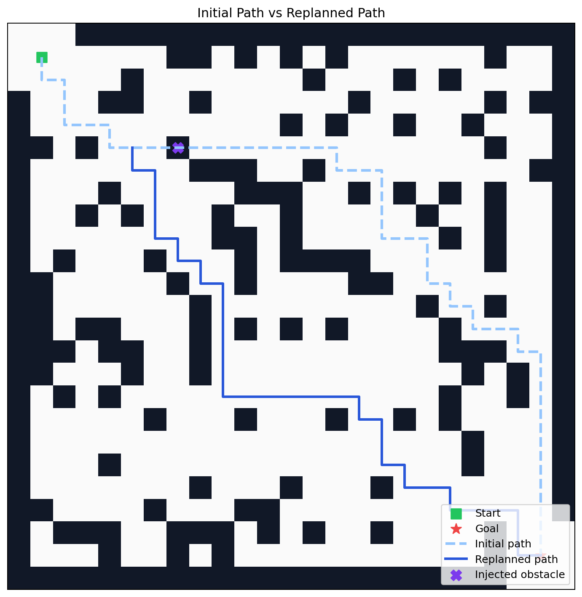

*图 8.2：动态障碍插入后，系统基于剩余空间重新生成替代路径。*

### 8.3 导航轨迹、平滑轨迹与运动学轨迹

项目在原始导航轨迹之外，还叠加了平滑轨迹与受转向约束的运动学轨迹，用于说明路径优化带来的轨迹连续性提升。

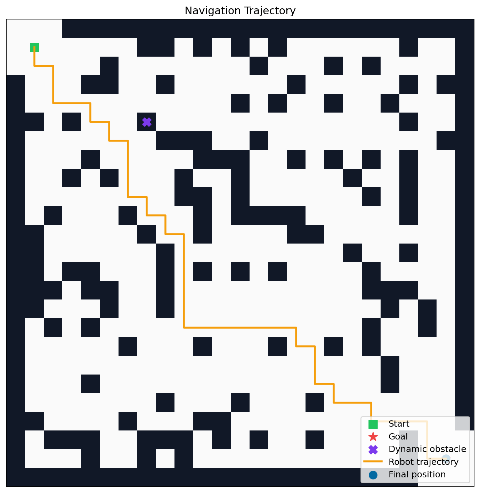

*图 8.3：机器人导航轨迹、平滑轨迹与运动学轨迹在同一环境中的可视化结果。*

为了更直观展示机器人在动态障碍插入后的实际运动过程，项目还输出了单次导航过程动图：

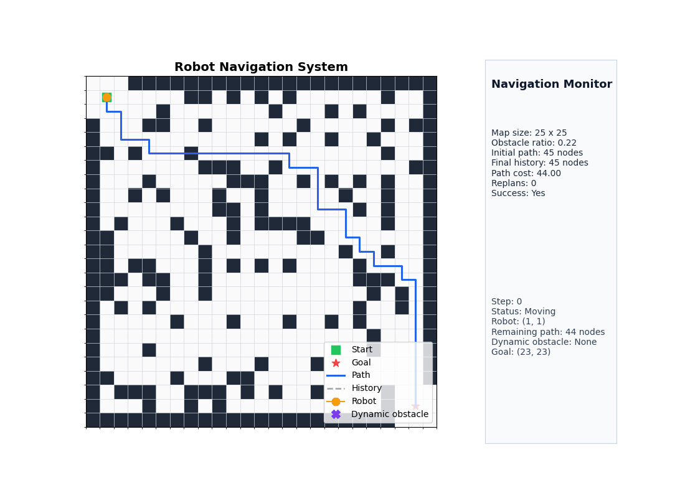

*图 8.4：机器人从起点出发、遭遇动态障碍、触发重规划并最终到达目标点的完整动态过程。*

从图中可以观察到，原始轨迹主要由离散栅格节点连接而成，存在较多拐点；平滑后路径去除了大量冗余折点；进一步施加运动学约束后，轨迹在转角处变得更加连续，这说明“可达路径”与“适合执行的路径”之间仍然存在优化空间。

### 8.4 单次实验中的算法对比

对于同一张地图，系统会输出不同算法的对比图，用于观察算法在路径形态、代价和搜索效率上的差异。

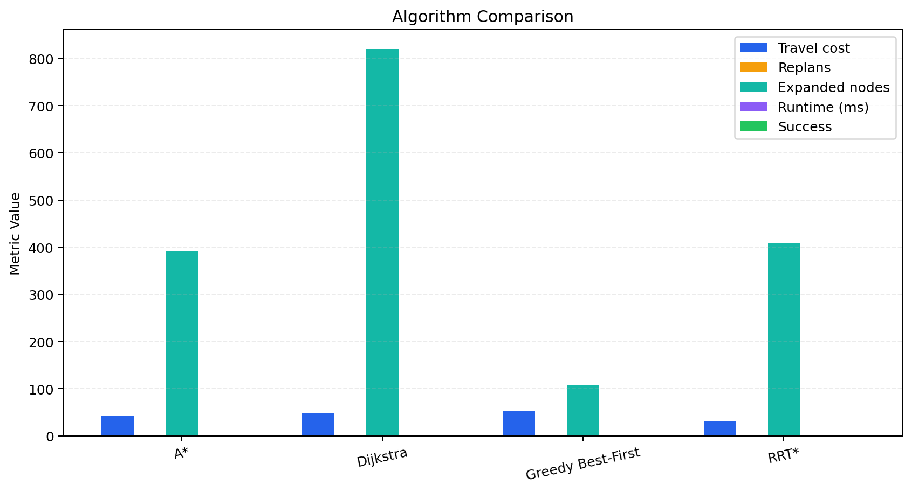

*图 8.4：在同一导航场景下，不同算法的总代价、重规划次数、扩展节点数与运行时间对比。*

### 8.5 批量地图实验结果

为了避免只依赖单一场景得出结论，系统额外构建了多张随机地图并进行批量测试。下图给出了批量实验的汇总结果。

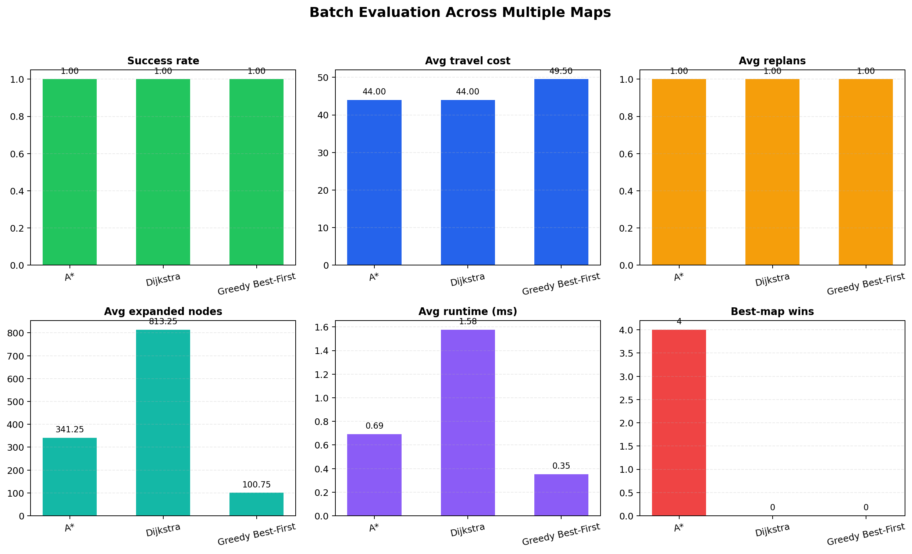

*图 8.5：批量地图实验下的成功率、平均路径代价、平均重规划次数、平均扩展节点数、平均运行时间与获胜次数统计。*

此外，系统还会为不同随机地图分别保存单独的算法对比图，用于观察不同环境结构下算法行为的变化。例如：

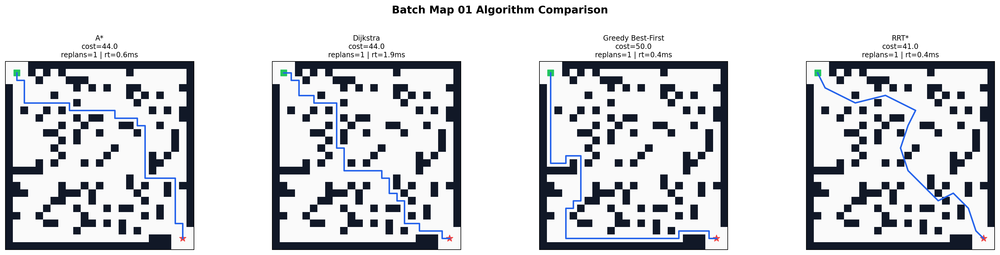

*图 8.6：某一随机地图下多种规划算法的路径与统计结果并列对比。*

对于批量实验中的导航过程，系统还额外生成了不同地图、不同算法对应的动图文件，用于展示各方法在相同场景下的实际行进过程和重规划响应。

例如，在同一张批量测试地图中，`A*` 的动态导航过程可表示为：

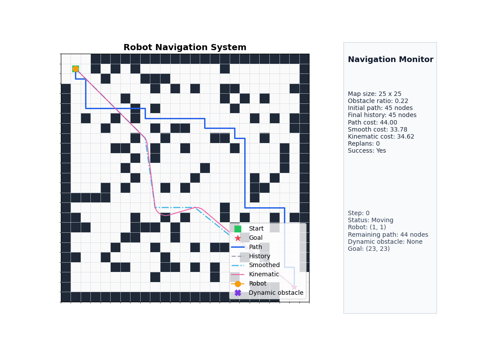

*图 8.7：`A*` 在批量实验某一测试地图中的实时导航与重规划过程。*

### 8.6 障碍密度变化实验

为了进一步说明环境复杂度对路径规划性能的影响，项目额外设计了障碍密度扫描实验。实验在相同起终点设置下，分别取较低、中等和较高三组障碍密度，对 `A*`、`Dijkstra` 和 `Greedy Best-First` 进行统一评测，输出成功率、平均路径代价、平均扩展节点数和平均运行时间的变化趋势。

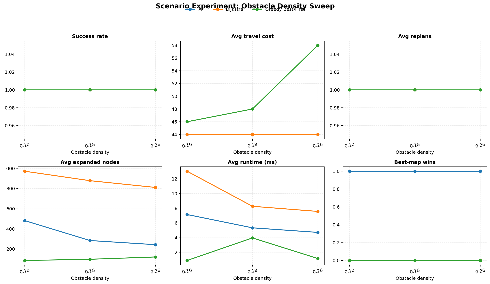

*图 8.8：随着障碍密度上升，不同算法在搜索效率与路径质量上的变化趋势。*

该实验主要说明两个问题：一是环境越拥挤，搜索空间越容易被障碍切割，算法需要花费更多代价寻找可行路径；二是启发式信息是否有效，会在复杂环境下被进一步放大。

从当前实验结果可以看出，在障碍密度由 `0.10` 提高到 `0.26` 的过程中，`A*` 的平均路径代价始终保持在 `44.0`，说明其在环境复杂度变化下仍能够稳定地产生较优路径。相比之下，`Greedy Best-First` 的平均路径代价由 `46.0` 上升至 `58.0`，表明该方法虽然具有较快的搜索速度，但在障碍结构趋于复杂时更容易受到局部启发信息的影响，从而产生次优路径。`Dijkstra` 的路径代价与 `A*` 基本接近，但其平均扩展节点数长期维持在 `800` 以上，搜索代价显著更高。由此可见，在障碍密度变化实验中，`A*` 在路径质量与搜索效率之间表现出更稳定的折中能力。

### 8.7 动态障碍触发时机实验

除了空间复杂度外，动态障碍出现的时机也会影响系统重规划负担。为此，项目设置了不同的障碍注入步数，对比障碍在较早、中等和较晚阶段出现时，导航总代价、重规划代价和运行时间的变化。

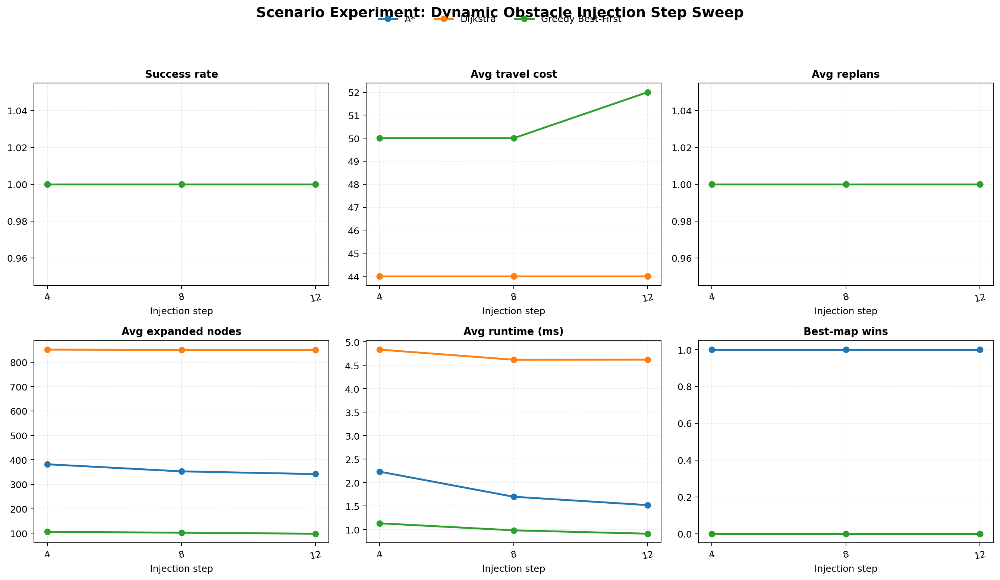

*图 8.9：动态障碍越早出现，剩余路径越长，算法越可能面临更大的后续重规划空间。*

该实验用于说明：同一算法在动态环境中的表现，不仅取决于地图结构，也取决于环境变化发生的时间点。较早的障碍触发通常意味着更大的路径调整空间，而较晚的障碍触发则更考验算法在局部受阻时的响应效率。

从实验输出可以看到，当动态障碍触发步数分别取 `4`、`8` 和 `12` 时，`A*` 的平均路径代价始终保持为 `44.0`，平均重规划次数稳定为 `1.0`，说明其对障碍出现时机具有较好的鲁棒性。`Greedy Best-First` 在三组设置下的平均路径代价分别为 `50.0`、`50.0` 和 `52.0`，始终高于 `A*`，反映出其在动态环境下更容易因局部贪心策略而牺牲整体路径质量。`Dijkstra` 虽然在路径代价上与 `A*` 一致，但其运行时间明显偏高，例如在触发步数为 `8` 时平均运行时间达到 `11.412 ms`。这说明在需要在线响应的导航任务中，`A*` 不仅能够保持较高的路径质量，而且具有更适中的实时计算开销。

### 8.8 地图尺度变化实验

在保持算法种类一致的前提下，项目还设计了不同地图尺度下的导航实验，用于观察地图规模扩张后搜索效率、路径代价与运行时间的变化规律。实验选择了三种代表性栅格尺寸，以较稳定的障碍密度进行测试。

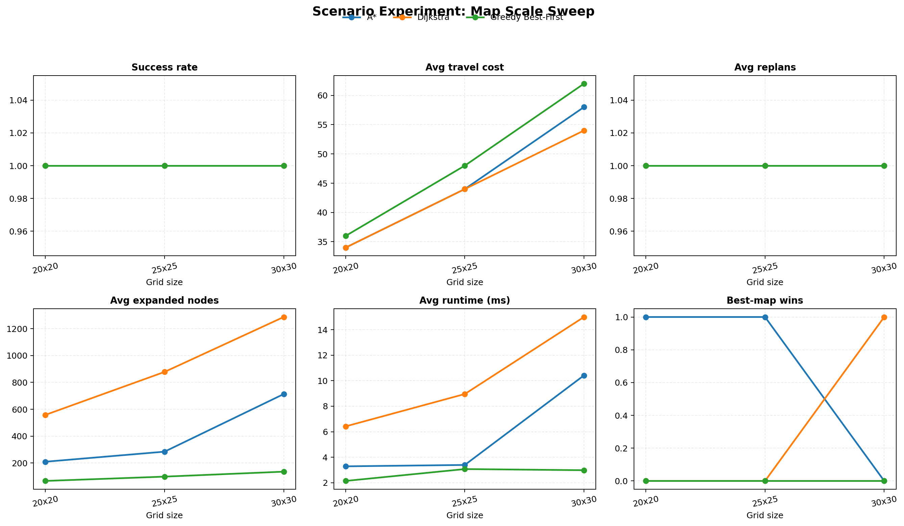

*图 8.10：地图尺寸扩大后，搜索空间随之增长，不同算法的扩展节点数与运行时间差异更加明显。*

这一实验的意义在于验证系统不仅能在单一地图上工作，而且可以在不同规模的环境中保持可分析性，从而使项目更接近“参数化仿真实验平台”的形态。

地图尺度实验进一步反映了算法在搜索空间扩张条件下的稳定性。随着栅格规模由 `20 x 20` 扩展至 `30 x 30`，各算法的运行时间与扩展节点数均呈上升趋势，这是由于状态空间规模扩大、绕障组合增多所致。在这一过程中，`A*` 仍能够借助启发式函数维持较强的目标导向性，从而避免 `Dijkstra` 式的大范围均匀扩展；与此同时，它又不像 `Greedy Best-First` 那样过度依赖局部启发信息，因此不会在复杂场景下显著牺牲路径质量。由此说明，随着地图规模增加，`A*` 在全局性与引导性之间的平衡优势反而更加明显。

## 9. 实验结果分析

### 9.1 综合表现

从单次导航实验和批量地图实验的结果来看，`A*`、`Dijkstra` 与 `Greedy Best-First` 都能够在当前二维栅格环境中完成基本导航任务，但三者在路径质量、搜索效率和稳定性方面存在明显差异。单次实验中，`A*` 在一次动态障碍插入后成功完成 `1` 次重规划，并以 `44.0` 的路径总代价到达目标点；在当前批量实验中，它又以相同的平均路径代价在 `4` 张测试地图上全部获得最佳结果，表现出较强的一致性。相比之下，`Dijkstra` 虽然通常也能找到与 `A*` 接近的路径，但平均扩展节点数更高，说明其需要付出更大的搜索代价；`Greedy Best-First` 在运行时间与扩展节点数方面更轻量，但更容易生成代价偏高的路径。

如果将 `RRT*` 一并考虑，则可以进一步看到不同方法适用场景的边界。`RRT*` 在连续空间规划中具有较强灵活性，但在当前离散栅格环境中，其采样与重连优势没有充分发挥出来，因此整体稳定性和一致性不如基于图搜索的 `A*`。同时，轨迹平滑与运动学约束的加入也说明，本项目的评价不再停留在“能否找到路”，而是进一步关注“找到的路径是否适合执行”。从结果来看，平滑后的路径折点明显减少，加入运动学约束后，轨迹由折线转变为更连续的转向曲线，这说明路径后处理对导航系统的工程合理性具有实际价值。

### 9.2 参数实验讨论

三组新增参数化实验进一步强化了上述判断。首先，在障碍密度变化实验中，`A*` 在障碍密度由 `0.10` 提高到 `0.26` 的过程中，平均路径代价始终保持在 `44.0`，说明其在环境复杂度变化下仍能稳定地获得较优路径；`Greedy Best-First` 的平均路径代价则由 `46.0` 上升至 `58.0`，显示出更明显的局部贪心缺陷；`Dijkstra` 虽然路径代价与 `A*` 接近，但扩展节点数长期维持在较高水平，搜索成本明显更大。其次，在动态障碍触发时机实验中，`A*` 在不同注入步数下的平均路径代价和重规划次数基本保持稳定，说明其在线响应具有较好的鲁棒性；`Dijkstra` 在保持路径质量的同时付出了更高的时间成本，而 `Greedy Best-First` 则更容易因局部启发偏置而损失整体路径质量。最后，在地图尺度变化实验中，随着栅格规模增大，各算法的运行时间和扩展节点数均有所上升，但 `A*` 依然能通过启发式引导控制搜索范围，表现出较好的规模适应能力。

这些实验共同说明，`A*` 的优势并不体现在某一项单独指标的绝对最优，而是体现在跨场景条件下的总体均衡性。它不像 `Dijkstra` 那样仅依赖累计代价进行大范围扩展，因此能够有效控制搜索开销；也不像 `Greedy Best-First` 那样过度依赖启发式距离，因此不会为了快速逼近目标而显著牺牲全局路径质量。换言之，`A*` 在 **路径质量、搜索效率、动态响应能力与跨场景稳定性** 四个维度上都没有明显短板，这正是它在本项目中被选为默认主算法的根本原因。

### 9.3 结果意义

从更高层的角度看，本项目的实验结果已经不只是证明“算法能够找到一条路”，而是回答了三个更有价值的问题：第一，在环境发生变化时，系统是否还能通过重规划继续完成导航；第二，在多种候选算法中，哪一种更适合作为实际系统中的主方案；第三，规划得到的离散路径能否通过平滑与运动学约束处理，进一步转化为更合理的执行轨迹。正因为这三个问题都得到了相对完整的实验支撑，本项目才提升为一个具有算法比较、过程验证和结果分析能力的导航仿真原型。

## 10. 当前验证边界与可进一步扩展的方向

需要明确的是，当前项目完成的是 **二维自建栅格环境中的算法级验证**，其结果能够说明不同规划算法在统一离散环境中的相对表现，也能够展示动态障碍下的重规划过程；但它还不能等价替代以下层面的验证：

- 基于 `ROS` 的消息通信与导航栈集成验证；
- 基于 `Gazebo`、`Webots` 等平台的物理级仿真验证；
- 基于激光雷达、相机、里程计等传感器的感知闭环验证；
- 基于真实底盘控制接口的执行层验证。

因此，当前结论更适合表述为“在二维栅格仿真环境下验证了算法有效性”，而不是“已经在机器人仿真平台完成系统级验证”。

在当前版本基础上，项目还可以继续向以下方向拓展：

- 接入更强的增量式规划算法，例如 `D* Lite`。
- 在交互仿真中支持更多动态障碍和多目标点导航。
- 将二维栅格仿真迁移到 `ROS + Gazebo`、`Webots` 或其他机器人仿真平台。
- 将当前的简化运动学约束扩展为差速模型或阿克曼模型。
- 进一步增加综合评分图、参数敏感性实验与算法消融实验。

## 11. 小结

本项目以栅格地图为基础，以多算法对比为主线，以动态重规划与轨迹优化为增强手段，构建了一套轻量但完整的机器人自主导航仿真系统。它既能直观展示机器人导航的过程，也能提供多维度实验指标支持算法比较，若进一步结合 `ROS + Gazebo`、`Webots` 或真实移动机器人底盘，本项目中的地图建模、全局规划、重规划判定和平滑策略都可以继续复用，因此它具备向更真实仿真平台迁移的工程延展。
