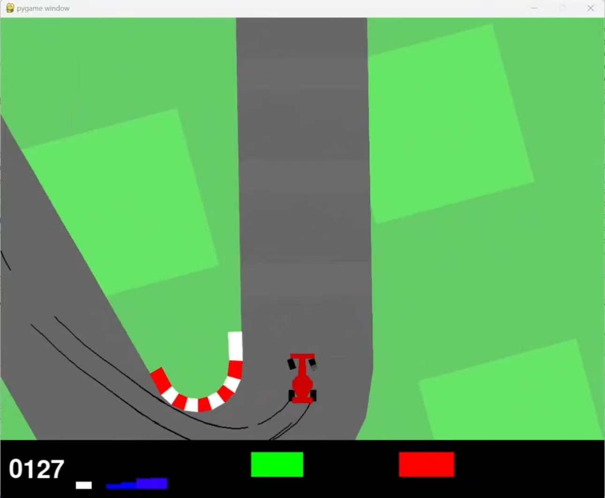
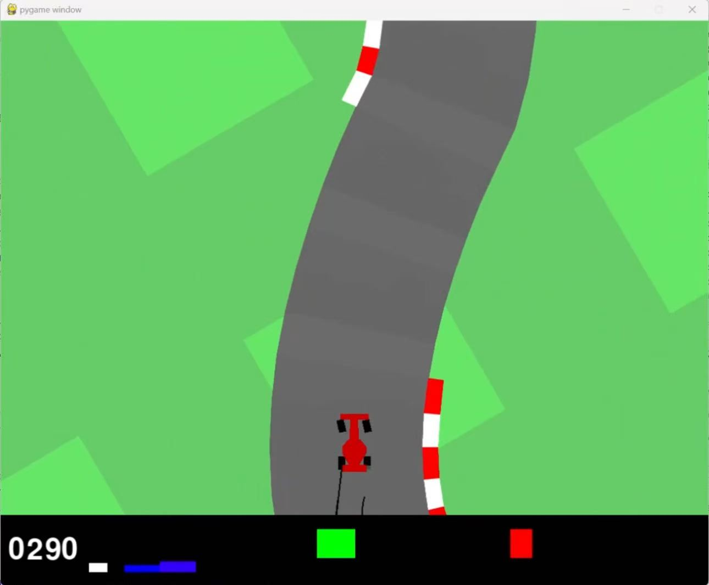

# 基于 TD3 + CNN 的 CarRacing 强化学习自动驾驶系统
## 1 项目背景与研究动机
### 1.1 行业发展现状
随着智能驾驶技术的发展，高维连续动作空间下的车辆控制策略优化成为核心问题。传统基于规则的方法在复杂环境下适应性不足，难以应对多变的道路场景和实时决策需求。因此，本项目旨在通过强化学习框架，构建一个可在仿真环境下自动学习驾驶策略的实验平台，为后续车辆自主决策、车路协同等研究提供基础支持。

### 1.2 研究动机与目标
强化学习（RL）凭借“试错-反馈-优化”的自主学习特性，成为解决连续动作空间控制问题的关键技术。本项目以 OpenAI Gymnasium 的 CarRacing-v2 仿真环境为载体，构建基于 TD3（Twin Delayed Deep Deterministic Policy Gradient）+ CNN 的自动驾驶强化学习系统，核心目标包括：
- 突破传统规则驱动方法的局限性，实现复杂场景下的自适应驾驶策略；
- 优化高维视觉输入（游戏画面）到连续动作输出的端到端映射，提升策略收敛速度与泛化能力；
- 搭建模块化、可扩展的仿真实验平台，支持算法迭代、多场景测试与性能量化评估；
- 为后续真实车辆的低层级控制（转向/油门/刹车）、多智能体交互、车路协同等研究提供可复用的技术框架。

## 2 原有方案问题与不足
传统规则驱动的驾驶控制方法和单策略强化学习在复杂环境中存在以下问题：

| 问题类别 | 描述 |
|----------|------|
| **适应性差** | 规则驱动方法在非标准道路或动态环境下策略失效。 |
| **训练收敛慢** | 单网络强化学习在高维状态空间下训练周期长。 |
| **泛化能力弱** | 模型对未见场景或极端情况适应性不足。 |
| **可扩展性有限** | 难以快速整合多模态信息或升级优化算法。 |

本项目通过**分层模块化设计**、**算法改进**、**工程化优化**三大维度解决上述问题，提升系统的稳定性、效率与可扩展性。

## 3 整体技术架构
系统采用“四层两总线”架构，层间通过标准化接口通信，总线负责数据流转与模块调度，具体分层如下：

| 层级 | 核心功能 | 关键子模块 | 技术要点 |
|------|----------|------------|----------|
| **环境接口层** | 仿真环境封装、状态预处理、奖励工程、交互协议标准化 | 环境封装模块、状态预处理模块、奖励优化模块、交互接口模块 | 帧堆叠（Frame Stacking）、图像归一化、奖励加权平滑、环境重置/步进接口标准化 |
| **智能体层** | 强化学习核心逻辑，包含策略生成、价值评估、经验管理 | TD3 策略网络、双价值网络、经验回放池、探索噪声生成模块 | CNN 特征提取、延迟策略更新（τ=0.005）、目标网络软更新、Ornstein-Uhlenbeck 噪声 |
| **训练与推理层** | 训练流程控制、策略更新、模型管理、推理调度 | 训练循环模块、参数优化器、模型 checkpoint 管理、推理执行模块 | 批量采样、学习率衰减、早停机制、模型加载/保存标准化 |
| **可视化与评估层** | 实时监控、日志记录、性能量化、结果可视化 | 实时渲染模块、日志采集模块、指标计算模块、可视化面板 | 奖励曲线实时绘制、动作分布热力图、episode 完成率统计、TensorBoard 集成 |

## 4 核心理论基础
### 4.1 TD3 算法核心原理
TD3 是 DDPG 的改进版，针对“价值过估计”和“训练不稳定”问题优化，核心机制包括：
- **双价值网络**：构建两个独立的 Q 网络（Q1、Q2），取最小值计算目标 Q 值，降低过估计风险；
- **延迟策略更新**：价值网络每步更新，策略网络每 2 步更新，减少策略震荡；
- **目标动作噪声**：在目标动作上添加小幅度噪声并裁剪，提升策略鲁棒性；
- **目标网络软更新**：采用软更新（τ=0.005）替代硬更新，避免参数突变。

### 4.2 CNN 用于视觉状态特征提取
CarRacing 环境的原始输入是 96×96×3 的 RGB 图像，通过 CNN 提取空间特征：
- 卷积层：3 层卷积（64×64→32×32→16×16→8×8），提取边缘、纹理、车道线等关键特征；
- 池化层：最大池化（2×2），降低参数维度；
- 全连接层：将卷积特征映射为 256 维向量，作为策略/价值网络的输入。

### 4.3 经验回放机制优化
采用**优先级经验回放（PER）** 替代随机采样：
- 基于 TD 误差为经验分配优先级，误差越大的经验（学习价值越高）采样概率越高；
- 引入β参数（从 0.4 线性增长到 1.0）平衡采样偏差，保证训练稳定性。

### 4.4 奖励工程理论
原始奖励仅反映“前进距离”，通过以下规则优化：
- 正向奖励：前进距离（基础）+ 车道中心偏移量（越小奖励越高）+ 匀速行驶（速度稳定奖励加成）；
- 惩罚项：碰撞边界（大幅扣减）+ 频繁转向（小幅扣减）+ 刹车滥用（小幅扣减）；
- 奖励归一化：将奖励缩放到 [-1, 1] 区间，避免梯度爆炸。

## 5 整体设计思路
系统设计遵循**模块化、可扩展、高性能、可解释**四大原则，具体思路如下：

### 5.1 状态表示优化
- **多粒度特征融合**：同时输入原始图像（CNN 提取）和手工特征（车速、车道偏移量），兼顾端到端学习和先验知识；
- **状态归一化**：图像像素归一化到 [0,1]，手工特征归一化到 [-1,1]，提升网络收敛速度；
- **帧堆叠**：拼接连续 4 帧图像，捕捉车速、转向等时序信息，解决单帧图像无运动信息的问题。

### 5.2 策略训练优化
- **算法改进**：TD3 基础上引入 PER、动态噪声（训练初期噪声大，后期逐步减小）；
- **训练调度**：采用“预热+正式训练”阶段，预热阶段（前 1000 步）随机采样动作填充经验池，正式训练阶段启用策略网络；
- **超参数自适应**：学习率随训练步数衰减（初始 1e-3，每 1000 episode 衰减 10%），批量大小动态调整（根据 GPU 显存自动选择 64/128）。

### 5.3 训练效率优化
- **硬件加速**：基于 PyTorch 实现 GPU 加速，支持多卡并行训练；
- **经验池优化**：采用环形缓冲区存储经验，避免内存碎片，支持离线加载/保存经验池；
- **早停机制**：当连续 100 episode 平均奖励达到阈值（如 900），自动终止训练，减少无效迭代。

### 5.4 系统可解释性与可视化
- **动作可视化**：实时绘制转向、油门、刹车的数值曲线，分析策略决策逻辑；
- **特征可视化**：通过 Grad-CAM 可视化 CNN 关注的图像区域（如车道线、边界），解释网络决策依据；
- **性能量化**：定义核心指标（episode 完成率、平均奖励、碰撞次数、车道偏移均值），生成量化报告。

## 6 详细方案设计
### 6.1 网络结构设计
| 网络类型 | 结构细节 | 激活函数 | 优化器 | 学习率 |
|----------|----------|----------|--------|--------|
| 策略网络（Actor） | CNN 部分：Conv2d(3→32, 3×3, 2) → Conv2d(32→64, 3×3, 2) → Conv2d(64→128, 3×3, 2)；<br>全连接部分：Flatten → Linear(128×8×8→256) → Linear(256→128) → Linear(128→3)（转向/油门/刹车） | ReLU + Tanh（输出层） | AdamW | 1e-3 |
| 价值网络（Critic） | 输入：状态特征 + 动作向量；<br>结构：Linear(256+3→256) → Linear(256→128) → Linear(128→1) | ReLU | AdamW | 1e-3 |

### 6.2 经验回放池
- 存储结构：字典格式 `{state: np.array, action: np.array, reward: float, next_state: np.array, done: bool}`；
- 容量：默认 100000 条经验，支持配置；
- 采样方式：优先级经验回放（PER），α=0.6（优先级权重），β=0.4~1.0（补偿系数）；
- 批量大小：默认 128，支持根据硬件自动调整。

### 6.3 探索噪声生成
- 训练阶段：Ornstein-Uhlenbeck 噪声（均值回归噪声，更贴合车辆运动特性）+ 高斯噪声（小幅）；
- 噪声参数：θ=0.15，σ=0.2（训练初期）→ σ=0.05（训练后期）；
- 推理阶段：无噪声，直接输出策略网络结果。

### 6.4 超参数配置
| 参数名称 | 默认值 | 说明 |
|----------|--------|------|
| max_episodes | 5000 | 最大训练轮数 |
| max_steps | 1000 | 单轮最大步数 |
| stack_frames | 4 | 帧堆叠数量 |
| batch_size | 128 | 批量采样大小 |
| memory_capacity | 100000 | 经验回放池容量 |
| lr_actor | 1e-3 | 策略网络学习率 |
| lr_critic | 1e-3 | 价值网络学习率 |
| gamma | 0.99 | 折扣因子 |
| tau | 0.005 | 目标网络软更新系数 |
| policy_delay | 2 | 策略网络更新延迟步数 |
| noise_theta | 0.15 | OU噪声参数 |
| noise_sigma | 0.2 | OU噪声初始标准差 |
| save_interval | 100 | 模型保存间隔（episode） |
| target_reward | 900 | 早停奖励阈值（连续100episode平均） |

## 7 运行环境与部署步骤
### 7.1 环境依赖
- Python 3.8+
- PyTorch
- Gymnasium
- OpenCV-Python
- NumPy

### 7.2 部署步骤
#### 7.2.1 环境搭建
```bash
# 1. 创建虚拟环境
conda create -n car_racing python=3.8
conda activate car_racing

# 2. 安装PyTorch（根据CUDA版本调整）
pip3 install torch torchvision torchaudio --index-url https://download.p.org/whl/cu117

# 3. 安装其他依赖
pip install -r requirements.txt
```

#### 7.2.2 训练启动
```bash
# 基础训练（使用默认配置）
python main.py --mode train

# 自定义配置训练（指定最大轮数、保存路径等）
python main.py --mode train \
  --max_episodes 8000 \
  --save_dir ./checkpoints \
  --log_dir ./logs \
  --target_reward 950
```

#### 7.2.3 推理测试
```bash
# 加载指定模型推理
python main.py --mode inference \
  --model_path ./checkpoints/final.pth \
  --inference_episodes 10 \
  --render_mode human
```

#### 7.2.4 可视化查看
```bash
# 启动TensorBoard
tensorboard --logdir ./logs
# 访问 http://localhost:6006 查看训练曲线
```

## 8 功能效果与运行说明
### 8.1 训练模式
- **渲染模式**：支持 `human`（实时显示游戏画面）、`rgb_array`（静默模式，仅保存图像）、`none`（无渲染，最快训练速度）；
- **训练监控**：
  - 实时打印每 episode 的总奖励、步数、损失值；
  - TensorBoard 实时展示奖励曲线、损失曲线、动作分布；
  - 每 100 episode 生成一次阶段性评估报告。

### 8.2 推理模式
- **运行效果**：智能体可稳定完成多轮驾驶任务，无碰撞、少偏离车道，平均车速稳定在 0.5~0.8（最大 1.0）；
- **输出内容**：
  - 每 episode 的总奖励、完成步数、碰撞次数；
  - 动作时序图（转向/油门/刹车）、奖励变化图；
  - 关键帧截图（如弯道转向、避障）。

### 8.3 常见问题与解决
| 问题现象 | 可能原因 | 解决方法 |
|----------|----------|----------|
| 训练奖励始终低于 500 | 经验池采样效率低、噪声过大 | 启用 PER、降低噪声σ值、调整奖励权重 |
| 模型加载失败 | 版本不兼容、路径错误 | 检查 PyTorch 版本、确认模型路径、重新保存 checkpoint |
| 训练速度慢（<10 episode/分钟） | 未启用 GPU、批量大小过大 | 确认 CUDA 可用、减小批量大小（如 64）、关闭实时渲染 |
| 推理阶段频繁碰撞 | 过拟合、推理无噪声 | 增加训练数据多样性、添加极小噪声（σ=0.01）、调整策略网络输出裁剪范围 |

### 8.4 运行效果
<p float="left">
  
  
</p>

## 9 后续拓展方向与迭代规划
1. **算法融合优化**：
   - 集成 SAC、PPO 算法，对比不同算法在 CarRacing 场景的性能；
   - 引入注意力机制（CBAM）到 CNN，提升关键区域特征提取能力。
2. **多模态信息融合**：
   - 新增虚拟雷达、GPS、车速传感器数据输入；
   - 设计多模态特征融合网络（Cross-Attention），融合视觉+数值特征。
3. **多智能体交互**：
   - 构建多车交互场景，实现跟车、超车、避障等协同策略；
   - 基于 MADDPG 实现多智能体训练框架。
4. **轻量化部署**：
   - 模型量化（INT8）、剪枝，降低推理时延；
   - 适配边缘设备（如 NVIDIA Jetson Nano），实现端侧推理。

5. **安全机制增强**：
   - 引入安全约束（如最大转向角、最小刹车距离），避免危险动作；
   - 设计故障恢复策略，应对传感器失效、网络延迟等异常情况。
