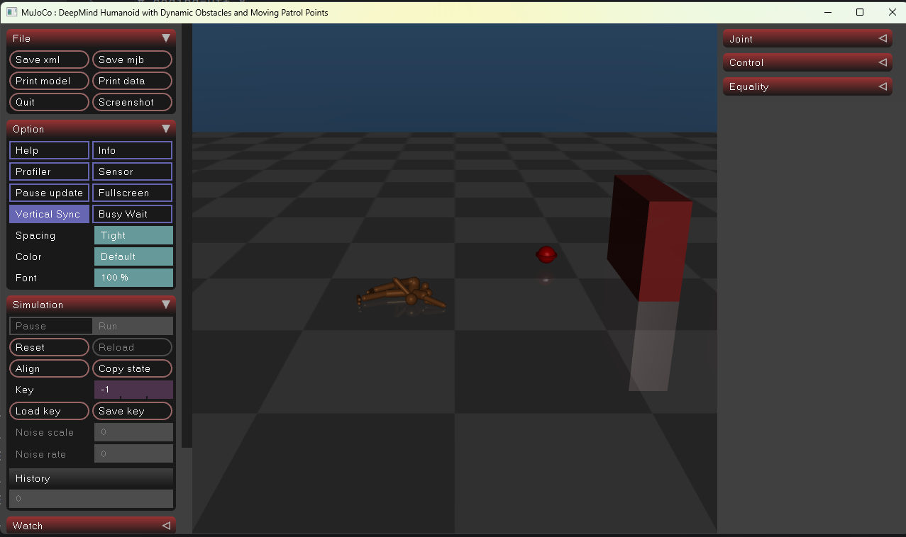

# DeepMind 人形机器人仿真系统 (DeepMind Humanoid Robot Simulation)

这是一个基于 Python 和 MuJoCo 物理引擎的机器人仿真项目。该项目旨在提供一个健壮的启动环境，用于模拟人形机器人的运动控制，特别是针对**多目标巡逻**与**动态避障**任务。

## 核心功能

本项目主要包含以下核心功能模块：

1.  **环境自检系统 (Environment Check)**
    *   自动检测项目目录结构，确保 `robot_walk` 子目录及其中的脚本和模型文件存在。
    *   检测 Python 解释器版本（推荐 3.8+）。
2.  **依赖管理 (Dependency Management)**
    *   自动检查 `mujoco` 和 `numpy` 等关键库是否安装。
    *   提供交互式自动安装功能，若缺少依赖，可一键安装。
3.  **仿真任务调度**
    *   **多目标巡逻 (Multi-target patrol)**：控制机器人在场景中按设定路径移动。
    *   **动态障碍物规避 (Dynamic obstacle avoidance)**：机器人能感知并避开移动的障碍物。
4.  **跨平台兼容性**
    *   针对 Windows 系统自动修复编码问题（`chcp 65001`），确保日志输出正常。

---

##  技术栈

| 类别 | 技术/库 | 说明 |
| :--- | :--- | :--- |
| **编程语言** | Python 3.8+ | 核心开发语言 |
| **物理引擎** | MuJoCo | 用于高保真机器人物理仿真 |
| **科学计算** | NumPy | 用于处理矩阵运算和机器人状态数据 |
| **核心模块** | Subprocess | 用于在子进程中调用控制脚本 |
| **路径处理** | pathlib | 跨平台路径操作 |

##  运行流程

### 人形机器人

运行 `main.py` 后，程序将按以下流程执行，实现人形机器人仿真：

1.  **初始化与检测**
    *   打印项目根目录。
    *   检查 `robot_walk` 目录及 `move_straight.py`、`Robot_move_straight.xml` 文件是否存在。
    *   **若文件缺失**：打印错误信息并终止程序。

2.  **环境检查**
    *   获取当前 Python 解释器路径。
    *   检查 Python 版本是否符合要求。

3.  **依赖检查与安装**
    *   检查 `mujoco` 和 `numpy` 是否已安装。
    *   **若缺失**：提示用户并询问是否自动安装 (`pip install`)。

4.  **启动仿真 (关键步骤)**
    *   设置环境变量（如 `MUJOCO_QUIET` 静默模式）。
    *   使用 `subprocess` 在 `robot_walk` 目录下运行 `move_straight.py`。
    *   此时，MuJoCo 窗口将弹出，展示机器人执行巡逻和避障的过程。

5.  **结束处理**
    *   仿真结束后，主程序捕获返回码并退出，确保资源释放。

###  ant机器人

1. 配置修改

在运行前，你可以直接编辑 `ant_config.py` 中的 `AntConfig` 类来调整机器人的行为：

- **步态参数**：调整 `gait_frequency` (步频) 或 `hip_swing_amp` (步幅)。
- **巡逻范围**：修改 `planner.py` 中的 `patrol_targets` 坐标。
- **避障灵敏度**：调整 `obstacle_margin` (感应半径) 和 `safe_distance` (安全距离)。

2. 启动仿真

在终端执行主程序：

```
1python env_manager.py
```

3. 运行效果

- **可视化窗口**：MuJoCo 3D 渲染窗口将弹出，显示 Ant 机器人的实时运动。
- 控制台输出
  - 启动时会打印当前的目标点序列。
  - 到达目标点时会提示 `🎯 到达目标点...`。
  - 按 `Ctrl+C` 可安全退出仿真。

---

## 运行示例



以上是运行界面，由于mujoco.viewer函数（也就是mujoco里默认的显示模块）不支持直接进行菜单修改，所以下面附上一些选项的中文注释：

### 📁 File (文件操作)

- **Save xml / mjb:** 保存当前的物理模型状态（xml 是明文格式，mjb 是编译后的二进制格式）。
- **Print model / data:** 在终端打印当前模型或仿真数据的详细内部信息。
- **Screenshot:** 对当前画面进行截图。

### ⚙️ Option (显示与渲染选项)

- **Profiler:** 性能分析器（打开后会在屏幕上显示物理引擎各阶段计算耗时的统计）。
- **Sensor:** 传感器可视化（显示传感器的数据反馈或作用范围）。
- **Vertical Sync:** 垂直同步（限制帧率以防止画面撕裂）。
- **Spacing / Color / Font:** 调整 UI 的间距、颜色主题和字体大小（可以通过 Font 把字调大一点，更容易看）。

### ⏯️ Simulation (仿真控制，最常用区域)

- **Pause / Run:** 暂停 / 继续仿真（快捷键通常是 `空格键`）。
- **Reset:** 将仿真重置到初始状态，时间归零，位置复原（快捷键通常是 `Backspace`）。
- **Reload:** 重新加载 XML 模型文件（修改 XML 模型代码后不用重启程序，直接点 Reload 即可，快捷键通常是 `Ctrl+L`）。
- **Align:** 将摄像机视角对齐到某个轴向。
- **Load key / Save key:** 保存和加载特定的仿真关键帧状态（方便你把机器人定格在某个特殊姿态反复测试）。

### 👉 右侧面板 (物理实体调试)

- **Joint (关节):** 展开后，可以在这里手动给机器人的某个关节施加外力，或者直接强行修改其位置（常用来测试机器人的抗干扰能力）。
- **Control (控制):** 手动调整各个执行器（电机）的输入信号大小。
- **Equality (约束):** 查看和调试模型中定义的等式约束（比如焊点、肌腱等）。
