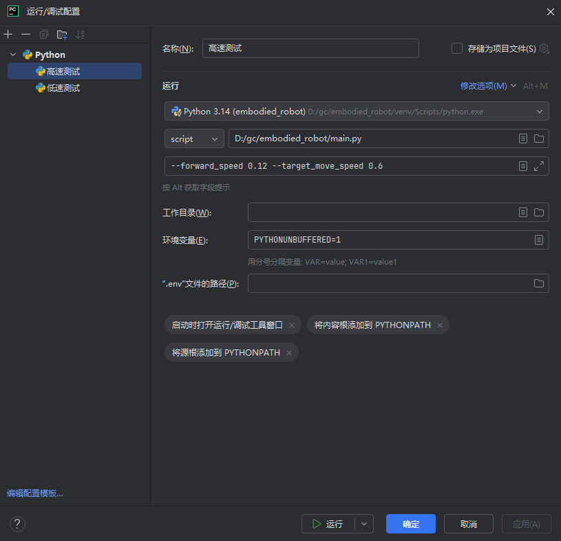
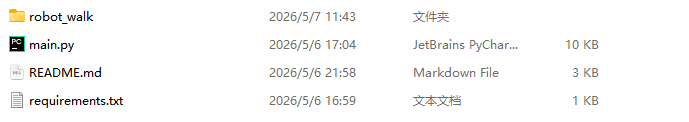
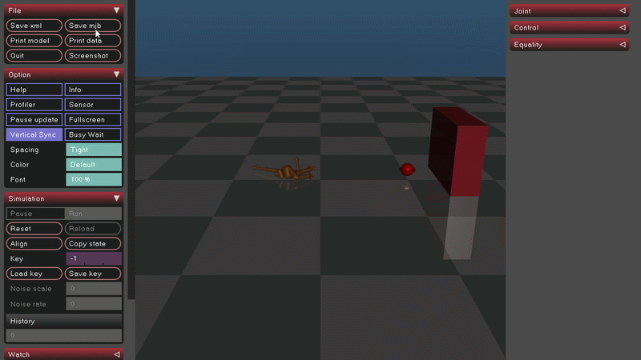

# DeepMind 人形机器人仿真系统 (DeepMind Humanoid Robot Simulation)

# 背景介绍

这是一个基于 Python 和 MuJoCo 物理引擎的机器人仿真项目。该项目旨在提供一个健壮的启动环境，用于模拟人形机器人的运动控制，特别是针对**多目标巡逻**与**动态避障**任务。

**DeepMind** 本身是一家隶属于 Google 的人工智能公司，以强化学习、机器人仿真著称，MuJoCo 也是 DeepMind 收购后开源的核心物理引擎，由于该项目基于 DeepMind 开源的 MuJoCo 引擎构建，因此以DeepMind命名。

# 项目介绍

本项目旨在实现：

## 距离优先的多目标巡逻

机器人周围有 5 个会自己乱跑的目标点。机器人会时刻计算自己离每个目标有多远，**谁离得最近就去追谁**，追到了就自动换下一个最近的目标，不按固定顺序走。

```python
def _select_closest_target(self, elapsed_time):
    # 获取机器人位置
    torso_pos = self.data.xpos[self.torso_id][:2]
    # 计算到每个目标的距离
    target_distances = []
    for idx, point in enumerate(self.patrol_points):
        distance = np.linalg.norm(torso_pos - point["pos"])
        target_distances.append((idx, distance))
    # 按距离排序，选最近的作为当前目标
    target_distances.sort(key=lambda x: x[1])
    closest_idx = target_distances[0][0]
    if closest_idx != self.current_target_idx:
        self.current_target_idx = closest_idx  # 切换到最近目标
    return self.current_target_idx
```

## 动态障碍物智能避障

场景里有几个会自己动来动去的墙（有的上下飘，有的左右晃，有的转圈）。机器人一旦发现某个墙离自己太近（＜2.5 米），就会自动向左或向右转，躲开它，等跑出一段距离后再回到原来的巡逻路线上。

```python
def _detect_obstacles(self, elapsed_time):
    # 计算机器人与每个墙的距离（预测动态墙的未来位置）
    if closest_wall["predicted_dist"] < self.obstacle_distance_threshold:
        self.avoid_obstacle = True
        self.obstacle_avoidance_start = elapsed_time
        # 根据障碍物与目标方向的叉积决定左转还是右转
        cross_product = np.cross(wall_relative, target_vector)
        self.turn_direction = -1 if cross_product > 0 else 1
```

避障期间的控制：

```python
if self.avoid_obstacle:
    # 让机器人朝 turn_direction 方向持续转弯
    self.data.ctrl[hip_z_right_id] = self.turn_direction * turn_speed * 0.5
    self.data.ctrl[hip_z_left_id]  = -self.turn_direction * turn_speed * 0.5
```

## 仿人步态与稳定平衡控制

机器人会像人一样交替迈腿、摆臂，同时通过腰部的扭动和质心调整让自己不会摔倒。所有关节的力量都限制在安全范围内，避免机器人突然飞出去或原地抽搐。

- `_control_robot_gait()` – 步态生成（腿、手臂摆动）
- `_maintain_balance()` – 躯干姿态和质心平衡
- `_clip_control_command()` – 限制电机输出上限

```python
def _control_robot_gait(self, elapsed_time):
    # 正弦波生成腿部摆动
    for side, sign in [("right", 1), ("left", -1)]:
        swing_phase = (phase + 0.5 * sign) % 1.0
        hip_x_cmd = self.swing_gain * np.sin(2 * np.pi * swing_phase) * self.forward_speed
        self.data.ctrl[hip_x_id] = self._clip_control_command(hip_x_cmd)
        ...
```

```python
def _maintain_balance(self, elapsed_time):
    # PD 控制躯干俯仰/横滚
    roll_error = self.torso_roll_target - roll
    cmd = self.balance_kp * roll_error - self.balance_kd * roll_vel
    self.data.ctrl[abdomen_x_id] = self._clip_control_command(cmd)
```

```python
def _clip_control_command(self, cmd):
    # 将电机指令限制在 [-100, 100] 内，防止失控
    return np.clip(cmd, -self.max_ctrl_amplitude, self.max_ctrl_amplitude)
```

## 仿真运行与可视化跟踪

启动 MuJoCo 的 3D 窗口，相机自动跟随机器人，保证它始终在屏幕中央。同时每 2 秒在控制台打印一次当前状态（位置、目标距离、最近障碍物等），按 Ctrl+C 可以随时结束并看总结报告。

**对应函数/代码**

- `run_simulation()` – 主循环，步进物理引擎，同步视图
- `_print_status()` – 输出实时状态

```python
def run_simulation(self):
    with viewer.launch_passive(self.model, self.data) as viewer_instance:
        # 相机跟随机器人
        viewer_instance.cam.trackbodyid = self.torso_id
        viewer_instance.cam.distance = 10.0
        while viewer_instance.is_running():
            # 更新控制逻辑
            self._control_robot_gait(elapsed_time)
            mujoco.mj_step(self.model, self.data)  # 物理步进
            viewer_instance.sync()
            self._print_status(elapsed_time)
```

```python
def _print_status(self, elapsed_time):
    # 每 2 秒打印：时间、位置、COM 高度、目标距离、最近障碍物、当前模式
    print(f"\r🕒 {elapsed_time:.1f}s | 📍 x={torso_pos[0]:.2f} | 🗺️ Distance: {distance:.2f}m | 🛡️ Obstacle: {obstacle_info}", end="")
```

# 新增功能

## 参数透传功能

```python
self.target_move_speed = 0.2  # Slow target movement for stability
self.forward_speed = 0.05  # Reduced speed to prevent flying (fix disappearing issue)
```

```python
self.target_move_speed = args.target_move_speed if args else 0.2  # 动态目标移动速度
self.forward_speed = args.forward_speed if args else 0.05  # 机器人前进速度
```

之前的代码把参数写死在代码里，想要修改参数就必须回到脚本中修改代码，很麻烦而且容易出错。现在引入了`argparse` 库来规范地接收参数，可以在 PyCharm 的 **Parameters** 配置框中（或者直接在终端里）输入参数，无需修改代码。




## 移除阻塞式的 `input()` (适配自动化部署)

```python
     # Ask for auto-install
    if input("\n📥 Auto-install missing packages? (y/n): ").lower() == 'y':
        try:
            subprocess.run(
                [sys.executable, "-m", "pip", "install"] + missing_packages,
                check=True
            )
            print("✅ Packages installed successfully")
        except subprocess.CalledProcessError as e:
            print(f"❌ Package installation failed: {e}")
            sys.exit(1)
```

```python
def get_user_input_with_timeout(timeout=5):
    print(f"\n📥 Auto-install missing packages? (y/n) [将在 {timeout} 秒后默认选择 'y']: ", end='', flush=True)
    user_response = [None]

    def wait_for_input():
        try:
            user_response[0] = input()
        except EOFError:
            pass
```

原代码当检测到用户没有安装标准库时，会自动弹出选项让用户判断是否安装库，但问题在于，如果用户不输入选项，进程就会永久停留在这一步。

修改后，当进程在此停留timeout的时间后，如果用户依然没有输入，程序就会自动选择y并开始安装标准库。

## 依赖项配置外置

```python
def check_dependencies():
    """
    Check required packages installation
    """
    required_packages = [
        "mujoco",
        "numpy"
    ]
```

```python
def check_dependencies():
    """
    Check required packages installation by reading requirements.txt
    """
    project_root = Path(__file__).resolve().parent
    req_file = project_root / "requirements.txt"
```

原代码写死了项目要安装的库，如果以后需要安装其它库的时候就需要修改代码，非常麻烦。

修改后，新增了requirements.txt文件，将依赖项全放置在其中，方便用户查看项目需要哪些依赖，也方便后面的增删。




# 失败集锦

在前期基础功能完善后，我开始着手研究如何让机器人走起来。目前还没有成功，我的小人依然还是倒在地上抽搐。



## 首先，可能存在两个问题：

**出生点穿模爆炸：** 设置的初始高度（`z=0.8`）可能太低了。如果机器人的脚在第 0 帧时嵌在了地板内部，MuJoCo 的物理引擎为了解决“物体穿透”，会瞬间施加一个成千上万牛顿的排斥力，直接把它弹飞、抽搐。

**重症肌无力：** 代码里有一句 `self.max_ctrl_amplitude = 0.8`。这意味着无论机器人怎么拼命想站稳，发出的电机指令都被死死限制在了 0.8。这点力气根本不足以对抗重力支撑起它自己的体重。

应对这两个问题，我做了如下调节：

```python
self.balance_kp = 120.0        # 增强平衡控制器的刚度，让腰板挺直

self.max_joint_velocity = 2.0  # 放宽关节限速

self.max_ctrl_amplitude = 5.0  # ✨ 核心修复：把电机最大输出拉高，给它支撑体重的力气！

self.data.qpos[2] = 0.95 # ✨ 核心修复：把出生点太高一点，让它处于悬空状态，避免脚插进地板里
```

```python
if elapsed_time < self.stabilization_phase:
            # ✨ 加入“上帝之手”：给躯干施加向上的外力，像提着衣领一样让它慢慢站稳落地
            if self.torso_id != -1:
                # 提拉力随着时间从 200N 线性递减到 0N
                lift_force = 200.0 * (1.0 - (elapsed_time / self.stabilization_phase))
                self.data.xfrc_applied[self.torso_id][2] = lift_force

            self._maintain_balance(elapsed_time)
            # Clip all control commands during stabilization
            for i in range(self.model.nu):
                self.data.ctrl[i] = self._clip_control_command(self.data.ctrl[i])
            return
        else:
            # ✨ 稳定期结束后，撤销上帝之手，让机器人完全靠自己的双腿站立
            if self.torso_id != -1:
                self.data.xfrc_applied[self.torso_id][2] = 0.0
```

但是修改代码后小人依然是立刻直接落地，没有悬停，也没有站立起来。

## 然后接着调查，发现可能是“上帝之手”力气太小了，也可能是电机的力量太小，无法支撑机器人。

所以接着修改：

```python
self.max_ctrl_amplitude = 100.0  # 彻底解除力量封印，允许电机输出足够的扭矩来支撑体重！

if elapsed_time < self.stabilization_phase:
            # ✨ 升级版“上帝之手”：动态读取模型总重量，对抗真实重力！
            if self.torso_id != -1:
                # 1. 计算机器人的总重力 (Mass * g)
                total_mass = np.sum(self.model.body_mass)
                gravity = np.abs(self.model.opt.gravity[2]) if self.model.opt.gravity[2] != 0 else 9.81
                robot_weight = total_mass * gravity
                
                # 2. 施加力：开局提供 1.1倍 体重的升力(略微向上悬浮)，随后线性减弱到 0.5倍(平稳降落)
                lift_ratio = 1.1 - 0.6 * (elapsed_time / self.stabilization_phase)
                self.data.xfrc_applied[self.torso_id][2] = robot_weight * lift_ratio

            self._maintain_balance(elapsed_time)
            # Clip all control commands during stabilization
            for i in range(self.model.nu):
                self.data.ctrl[i] = self._clip_control_command(self.data.ctrl[i])
            return
        else:
            # 稳定期结束，撤销外力，完全靠双腿站立
            if self.torso_id != -1:
                self.data.xfrc_applied[self.torso_id][2] = 0.0
```

但还是一样，和最初版本几乎没有差别。

## 后来分析，可能是遇到了 MuJoCo 物理引擎里最不讲理的“碰撞穿模惩罚机制”。

在 MuJoCo 中，只要机器人的脚底板和地面发生了哪怕 $0.1$ 毫米的“穿透（Penetration）”，物理引擎为了把它们分开，会瞬间产生高达**数万牛顿**的排斥力。这个力比刚才算的几百牛顿的“体重提拉力”大了几十倍，所以机器人的力学状态瞬间就爆炸了，直接被拍在地上抽搐。

这次，不再给它施加什么向上的力了，而是**直接在每一帧强行改写它躯干的空间坐标**。就像把它用钉子钉在半空中一样，无视重力，无视碰撞，强行让它在空中把腿伸直，然后再“拔掉钉子”让它落地。

```python
# Step 5: Initial stabilization phase (no movement, only balance)
        if elapsed_time < self.stabilization_phase:
            # ✨ 核弹级修复：时空绝对锁死！
            # 直接在内存底层把机器人“钉”在空中，无视任何物理法则
            
            # 1. 强行锁定根节点空间坐标 (悬空在 0.95m 处)
            self.data.qpos[0] = 0.0
            self.data.qpos[1] = 0.0
            self.data.qpos[2] = 0.95
            
            # 2. 强行锁定绝对垂直姿态 (四元数 [w, x, y, z])
            self.data.qpos[3:7] = [1.0, 0.0, 0.0, 0.0]
            
            # 3. 强行清零六轴速度 (禁止任何移动和旋转)
            self.data.qvel[0:6] = 0.0
            
            # 清除之前没用的外力
            if self.torso_id != -1:
                self.data.xfrc_applied[self.torso_id][2] = 0.0

            # 在被死死钉在空中的这两秒内，让四肢活动，摆出站立准备姿势
            self._maintain_balance(elapsed_time)
            
            for i in range(self.model.nu):
                self.data.ctrl[i] = self._clip_control_command(self.data.ctrl[i])
            return
```

可是依然没有变化。

## 怀疑可能根本没有修改机器人的参数，寻址出错了。

这段代码的作者做了一个**极其危险的假设**：它假设这个 XML 世界里**只有机器人自己**。如果只有机器人，它的主关节（freejoint）确实霸占了内存的第 `0` 到 `6` 个格子。

**但是！场景里加入了红色的巡逻点（patrol_slide）、加入了会动的墙壁（wall_slide）。在 MuJoCo 读取 XML 时，如果这些障碍物的关节排在了机器人的前面，那么 `qpos[0], qpos[1], qpos[2]` **就不再属于机器人了，而是属于某面墙或者某个球！**

这不仅解释了为什么你把它改成 `3.0` 机器人没反应（因为你把某面墙弄到天花板上去了），更解释了**为什么你的机器人落地会疯狂抽搐**——因为 `self.data.qpos[joint_id + 6]` 把原本该给“左膝盖”弯曲的数据，塞进了“右肩膀”的内存里，机器人的关节彻底错乱了，落地当然会像面条一样抽搐！

所以接下来尝试采用动态智能寻址：

```python
    def _set_initial_pose(self):
        """智能寻址：动态获取真实关节坐标，彻底解决初始姿态扭曲问题"""
        mujoco.mj_resetData(self.model, self.data)
        self.data.ctrl[:] = 0.0
        self.data.qvel[:] = 0.0
    # 1. 安全获取机器人躯干 (freejoint) 的真实内存地址
    if self.torso_id != -1:
        root_jnt_id = self.model.body_jntadr[self.torso_id]
        if root_jnt_id != -1:
            # 拿到了它在 qpos 数组里真正的起跑线！
            qpos_adr = self.model.jnt_qposadr[root_jnt_id]
            
            # 动态改写正确的 qpos 地址
            self.data.qpos[qpos_adr + 0] = 0.0  # x
            self.data.qpos[qpos_adr + 1] = 0.0  # y
            self.data.qpos[qpos_adr + 2] = 0.95 # ✨ 悬空高度改这里！现在绝对对机器人有效了！
            # 姿态四元数 w,x,y,z (保持完全直立)
            self.data.qpos[qpos_adr + 3:qpos_adr + 7] = [1.0, 0.0, 0.0, 0.0]

    # 2. 安全设置四肢各个关节的初始角度
    joint_positions = {
        "abdomen_x": 0.0, "abdomen_y": 0.0, "abdomen_z": 0.0,
        "hip_x_right": 0.0, "hip_y_right": -0.2, "hip_z_right": 0.0,
        "knee_right": 0.2, "ankle_x_right": 0.0, "ankle_y_right": 0.1,
        "hip_x_left": 0.0, "hip_y_left": -0.2, "hip_z_left": 0.0,
        "knee_left": 0.2, "ankle_x_left": 0.0, "ankle_y_left": 0.1,
        "shoulder1_right": 0.0, "shoulder2_right": 0.0, "elbow_right": -0.1,
        "shoulder1_left": 0.0, "shoulder2_left": 0.0, "elbow_left": -0.1
    }
    for joint_name, target_pos in joint_positions.items():
        mapped_name = self.joint_name_mapping.get(joint_name, joint_name)
        joint_id = mujoco.mj_name2id(self.model, mujoco.mjtObj.mjOBJ_JOINT, mapped_name)
        if joint_id != -1:
            # ⚠️ 核心修复：通过 jnt_qposadr 获取真实内存地址，彻底杜绝关节信号错位
            adr = self.model.jnt_qposadr[joint_id]
            self.data.qpos[adr] = target_pos
```

```python
if elapsed_time < self.stabilization_phase:
            # ✨ 动态时空锁死：精准锁定机器人的真实坐标，避免开局抽搐
            if self.torso_id != -1:
                root_jnt_id = self.model.body_jntadr[self.torso_id]
                if root_jnt_id != -1:
                    qpos_adr = self.model.jnt_qposadr[root_jnt_id]
                    qvel_adr = self.model.jnt_dofadr[root_jnt_id]
                    
                    # 绝对锁死空间位置，死死钉在 0.95m 的空中
                    self.data.qpos[qpos_adr + 0] = 0.0
                    self.data.qpos[qpos_adr + 1] = 0.0
                    self.data.qpos[qpos_adr + 2] = 0.95
                    self.data.qpos[qpos_adr + 3:qpos_adr + 7] = [1.0, 0.0, 0.0, 0.0]
                    
                    # 绝对锁死身体线速度和角速度
                    self.data.qvel[qvel_adr:qvel_adr + 6] = 0.0
                
                # 清除残留的外力
                self.data.xfrc_applied[self.torso_id][2] = 0.0

            self._maintain_balance(elapsed_time)
            for i in range(self.model.nu):
                self.data.ctrl[i] = self._clip_control_command(self.data.ctrl[i])
            return
```

但是，还是没有变化。

## 怀疑是没有找对控制全局高度和坐标的 `Free Joint`自由节点。

这一次，全场扫描！不管它叫什么名字，不管它挂在谁身上，直接找出全场唯一一个类型为 `mjJNT_FREE`（自由关节）

```python
   def _set_initial_pose(self):
        """终极智能寻址：通过 jnt_type 寻找全局自由关节，绝对安全地设置初始位置"""
        mujoco.mj_resetData(self.model, self.data)
        self.data.ctrl[:] = 0.0
        self.data.qvel[:] = 0.0
    # 1. 扫描全场：查找模型中真正的全局根关节 (Free Joint)
    free_joint_id = -1
    for i in range(self.model.njnt):
        if self.model.jnt_type[i] == mujoco.mjtJoint.mjJNT_FREE:
            free_joint_id = i
            break

    if free_joint_id != -1:
        qpos_adr = self.model.jnt_qposadr[free_joint_id]
        # 自由关节包含7个数据位：[x, y, z, qw, qx, qy, qz]
        self.data.qpos[qpos_adr + 0] = 0.0  # x坐标
        self.data.qpos[qpos_adr + 1] = 0.0  # y坐标
        self.data.qpos[qpos_adr + 2] = 0.95 # ✨ 悬空高度！现在绝对有效了！
        self.data.qpos[qpos_adr + 3:qpos_adr + 7] = [1.0, 0.0, 0.0, 0.0]

    # 2. 安全设置四肢各个关节的初始角度
    joint_positions = {
        "abdomen_x": 0.0, "abdomen_y": 0.0, "abdomen_z": 0.0,
        "hip_x_right": 0.0, "hip_y_right": -0.2, "hip_z_right": 0.0,
        "knee_right": 0.2, "ankle_x_right": 0.0, "ankle_y_right": 0.1,
        "hip_x_left": 0.0, "hip_y_left": -0.2, "hip_z_left": 0.0,
        "knee_left": 0.2, "ankle_x_left": 0.0, "ankle_y_left": 0.1,
        "shoulder1_right": 0.0, "shoulder2_right": 0.0, "elbow_right": -0.1,
        "shoulder1_left": 0.0, "shoulder2_left": 0.0, "elbow_left": -0.1
    }
    for joint_name, target_pos in joint_positions.items():
        mapped_name = self.joint_name_mapping.get(joint_name, joint_name)
        joint_id = mujoco.mj_name2id(self.model, mujoco.mjtObj.mjOBJ_JOINT, mapped_name)
        if joint_id != -1:
            adr = self.model.jnt_qposadr[joint_id]
            self.data.qpos[adr] = target_pos
```

```python
    #Step 5: Initial stabilization phase (no movement, only balance)
    if elapsed_time < self.stabilization_phase:
        # ✨ 终极时空锁死：根据 jnt_type 精准锁定，不再受 XML 层级干扰
        free_joint_id = -1
        for i in range(self.model.njnt):
            if self.model.jnt_type[i] == mujoco.mjtJoint.mjJNT_FREE:
                free_joint_id = i
                break

        if free_joint_id != -1:
            qpos_adr = self.model.jnt_qposadr[free_joint_id]
            qvel_adr = self.model.jnt_dofadr[free_joint_id]

            # 绝对锁死空间位置，死死钉在 0.95m 的空中
            self.data.qpos[qpos_adr + 0] = 0.0
            self.data.qpos[qpos_adr + 1] = 0.0
            self.data.qpos[qpos_adr + 2] = 0.95
            self.data.qpos[qpos_adr + 3:qpos_adr + 7] = [1.0, 0.0, 0.0, 0.0]

            # 绝对锁死身体线速度和角速度 (Freejoint 有 6 个自由度)
            self.data.qvel[qvel_adr:qvel_adr + 6] = 0.0

        # ⚠️ 关键步骤：强制物理引擎立刻更新运动学状态，确保不跳帧
        mujoco.mj_kinematics(self.model, self.data)

        self._maintain_balance(elapsed_time)
        for i in range(self.model.nu):
            self.data.ctrl[i] = self._clip_control_command(self.data.ctrl[i])
        return
```

还是没有改变。

## 怀疑是小人模型有问题，于是重新读了Robot_move_straight.xml文件

这次再找出了两个问题：

一：小人被“活埋”在了水泥地里（XML 的秘密）

 `Robot_move_straight.xml` 文件里面对小人身体的定义是这样的： `<body name="torso" pos="0 0 1.282" childclass="body">` 这意味着，这个小人光是**腿长加上半身，站直了就有 1.282 米高！** 但在代码中， `self.data.qpos[2] = 0.8`。这相当于在开局的第 0 秒，强行把一个 1.28 米的小人塞进了离地 0.8 米的坐标里**。它的半条腿直接卡进了实心的地板里！ MuJoCo 的物理引擎发现“严重穿模”，就会在瞬间施加几万牛顿的排斥力想把它挤出来，这就是它为什么落地会**疯狂抽搐（爆炸）**的根本原因。

二：移动的根本不是小人（内存地址被抢了）

在 XML 里，在小人的前面定义了非常多的动态墙壁和巡逻点（比如 `wall2_slide_y`, `patrol1_slide_x`）。 在 MuJoCo 中，所有的关节坐标是排队存放在一个叫 `qpos` 的长数组里的。 代码里写着 `self.data.qpos[2] = ...`，以为是在修改小人的 Z 轴，但实际上，因为墙壁和巡逻点排在小人前面，**`qpos[2]` 早就被墙壁抢走了！** 修改的坐标，实际上是在天花板上乱挪某一面墙，而真正的小人一直待在原地被“活埋”抽搐

```python
    def _set_initial_pose(self):
        """精准固定机器人初始位置到空中，彻底解决消失和抽搐问题"""
        mujoco.mj_resetData(self.model, self.data)
        self.data.ctrl[:] = 0.0
        self.data.qvel[:] = 0.0
    # 1. 通过名字精准找到机器人的根关节 (root)
    root_id = mujoco.mj_name2id(self.model, mujoco.mjtObj.mjOBJ_JOINT, "root")
    if root_id != -1:
        qpos_adr = self.model.jnt_qposadr[root_id]
        # 自由关节有7个坐标：x, y, z, qw, qx, qy, qz
        self.data.qpos[qpos_adr + 0] = 0.0   # X 坐标
        self.data.qpos[qpos_adr + 1] = 0.0   # Y 坐标
        self.data.qpos[qpos_adr + 2] = 1.35  # ✨ 核心修复：1.35米！绝对高于它的腿长，保证完美悬空！
        self.data.qpos[qpos_adr + 3:qpos_adr + 7] = [1.0, 0.0, 0.0, 0.0]  # 端正姿态

    # 2. 强制设置四肢关节
    joint_positions = {
        "abdomen_x": 0.0, "abdomen_y": 0.0, "abdomen_z": 0.0,
        "hip_x_right": 0.0, "hip_y_right": -0.2, "hip_z_right": 0.0,
        "knee_right": 0.2, "ankle_x_right": 0.0, "ankle_y_right": 0.1,
        "hip_x_left": 0.0, "hip_y_left": -0.2, "hip_z_left": 0.0,
        "knee_left": 0.2, "ankle_x_left": 0.0, "ankle_y_left": 0.1,
        "shoulder1_right": 0.0, "shoulder2_right": 0.0, "elbow_right": -0.1,
        "shoulder1_left": 0.0, "shoulder2_left": 0.0, "elbow_left": -0.1
    }
    for joint_name, target_pos in joint_positions.items():
        mapped_name = self.joint_name_mapping.get(joint_name, joint_name)
        joint_id = mujoco.mj_name2id(self.model, mujoco.mjtObj.mjOBJ_JOINT, mapped_name)
        if joint_id != -1:
            # ✨ 核心修复：必须通过 jnt_qposadr 获取真实内存地址！
            adr = self.model.jnt_qposadr[joint_id] 
            self.data.qpos[adr] = target_pos
```

```python
    #Step 5: Initial stabilization phase (no movement, only balance)
    if elapsed_time < self.stabilization_phase:
        # ✨ 终极时空锁死
        root_id = mujoco.mj_name2id(self.model, mujoco.mjtObj.mjOBJ_JOINT, "root")
        if root_id != -1:
            qpos_adr = self.model.jnt_qposadr[root_id]
            qvel_adr = self.model.jnt_dofadr[root_id]

            # 死死钉在 1.35m 的空中
            self.data.qpos[qpos_adr + 0] = 0.0
            self.data.qpos[qpos_adr + 1] = 0.0
            self.data.qpos[qpos_adr + 2] = 1.35
            self.data.qpos[qpos_adr + 3:qpos_adr + 7] = [1.0, 0.0, 0.0, 0.0]
            self.data.qvel[qvel_adr:qvel_adr + 6] = 0.0

        # ⚠️ 强制物理引擎立刻更新状态，避免跳帧
        mujoco.mj_kinematics(self.model, self.data)

        self._maintain_balance(elapsed_time)
        for i in range(self.model.nu):
            self.data.ctrl[i] = self._clip_control_command(self.data.ctrl[i])
        return
```

但是还是没有变化

## 提取了model文件和data文件，进一步分析


发现Joint ID（关节ID） ≠ DOF ID（速度地址），也就是说对于脚部关节的速度设置可能移动到了腰部，所以小人在以脚步关节的速度翻转。

```python
def _get_joint_vel_id(self, joint_name):
        """Get joint velocity ID for a given joint name"""
        mapped_name = self.joint_name_mapping.get(joint_name, joint_name)
        joint_id = mujoco.mj_name2id(self.model, mujoco.mjtObj.mjOBJ_JOINT, mapped_name)
        if joint_id != -1:
            # ✨ 史诗级底层修复：绝对不能直接返回 joint_id！
            # 必须通过 jnt_dofadr 查询该关节在 qvel 数组中真正的内存地址！
            return self.model.jnt_dofadr[joint_id]
        return -1
```

但是，还是没有变化，目前仍然没有找到问题所在。

# 后期计划

目前怀疑是小人的结构过于复杂，所以打算之后换个简单的小人模型。

目标是先让小人站起来，能够行走，然后再考虑复杂功能。